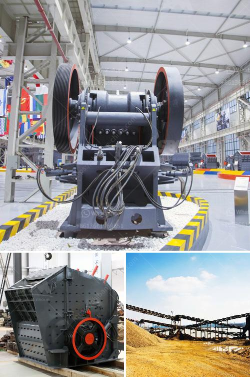

<h3>how to choose mill and crusher ？</h3>
When it comes to crushing or grinding various materials, the right mill and crusher can make all the difference. Whether you are processing minerals, food ingredients, or recyclable materials, selecting the appropriate equipment is crucial to ensure efficient and effective operations. In this article, we will discuss the significant factors to consider when choosing a mill and crusher.

The first and foremost consideration is the compatibility of the mill and crusher with the material being processed. Different materials have varying hardness, moisture content, and brittleness, which affect the equipment's performance. For instance, some materials require a mill with additional features like high temperature resistance or anti-corrosion properties. Therefore, it is essential to understand the characteristics of the material and select the equipment accordingly.

The desired production capacity and output size are critical factors in choosing a mill and crusher. The capacity requirement will determine the size and power of the equipment needed, while the desired output size will determine the type of crusher or mill suitable for the job. For example, a high-capacity hammer mill might be preferable for coarse grinding, while a ball mill could be more suitable for finer applications.

Energy consumption is a significant consideration for both economic and environmental reasons. Therefore, choosing energy-efficient equipment is crucial. Consider factors like motor power, energy consumption per unit of processing, and the overall efficiency of the machine.

Mill and crusher selection should also take into account the maintenance and operational costs. Equipment with complex parts and frequent maintenance requirements might result in higher operational costs over time. Therefore, consider equipment that offers easy maintenance, accessible spare parts, and a reputation for durability and reliability.

Safety should always be a top priority in selecting mill and crusher equipment. Look for safety features that protect operators from potential hazards like dust, noise, or moving parts. Safety interlocks and emergency shut-off systems should be included to protect both personnel and the machine itself.

While cost is not the only factor, it is undoubtedly an important consideration. Carefully weigh the initial investment against the long-term return on investment (ROI) for the chosen equipment. Consider factors such as lifespan, productivity gains, and energy efficiency when evaluating the overall cost-effectiveness of the equipment.

Choosing the right mill and crusher can be a complex decision. Seeking advice from industry experts or equipment manufacturers can provide valuable insights and guidance. These professionals can evaluate your specific requirements and recommend the most suitable equipment for your needs.

In conclusion, selecting the right mill and crusher is crucial for efficient and effective material processing. Consider the material compatibility, capacity and output size, energy efficiency, maintenance and operational costs, safety features, and cost-effectiveness. Seeking professional advice can also be beneficial. By carefully considering these factors, you can ensure that you choose equipment that maximizes productivity, minimizes downtime, and meets your overall operational needs.
<h3>Contact us</h3><ul><li><strong>Whatsapp:&nbsp;<a href="https://wa.me/8613661969651">+8613661969651</a></strong></li><li><a href="https://swt.shibang-china.com/?git&amp;zhl&amp;how to choose mill and crusher ？"><strong>Online Service(chat now)</strong></a></li></ul><h3>Related</h3><ul><li><a href='how does the quarry affect the biodiversity in tamil nadu .md'>how does the quarry affect the biodiversity in tamil nadu ?</a></li><li><a href='How to improve coal crusher hammer life .md'>How to improve coal crusher hammer life ?</a></li><li><a href='How to choose a limestone hammer mill ？.md'>How to choose a limestone hammer mill ？</a></li><li><a href='How to install a sand making machine.md'>How to install a sand making machine?</a></li><li><a href='How to crush concrete for recycling .md'>How to crush concrete for recycling ?</a></li></ul>