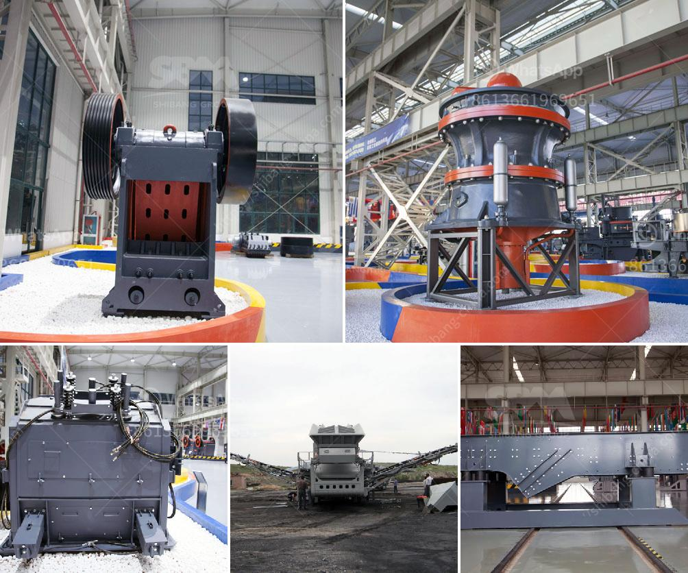

<h3>how to choose mobile rock crusher machines？</h3>
In today's modern world, mobile rock crusher machines have gained immense popularity due to their versatility and convenience. These machines are fast becoming essential equipment in industries such as mining, construction, and recycling. However, with various choices available on the market, it can be challenging to select the best mobile rock crusher machine for your specific needs. In this article, we will discuss some key factors to consider when choosing a mobile rock crusher machine.

Firstly, it is crucial to determine the type and size of material you will be processing. This will help you determine the specific features and capabilities required for your mobile rock crusher machine. If you are dealing with smaller materials such as gravel or crushed stone, a smaller machine with a lower capacity may suffice. However, if you are tackling larger rocks or concrete, you will need a heavy-duty machine with high crushing capacity.

Next, consider the mobility aspect of the mobile rock crusher machine. The advantage of these machines is that they can be easily moved from one site to another. Therefore, it is important to assess the transportation and working conditions at your job sites. If you have frequent site changes or need to move the machine through narrow spaces, a compact and highly maneuverable mobile rock crusher machine would be ideal. On the other hand, if your job sites are more stable, you may opt for a larger machine with a higher production capacity.

Another critical factor to evaluate is the power source for the mobile rock crusher machine. Different machines are powered by various energy sources such as diesel, electric, or hybrid. Each power source has its own advantages and disadvantages. Diesel-powered machines are known for their reliability and high power, making them suitable for remote and off-grid locations. Electric-powered machines, on the other hand, are more eco-friendly and cost-effective in terms of energy consumption. Hybrid machines offer the best of both worlds, with the ability to switch between diesel and electric power sources.

Furthermore, it is important to consider the maintenance and service requirements of the mobile rock crusher machine. Look for machines that offer easy access to essential parts for routine maintenance and repairs. Additionally, inquire about the availability of spare parts and after-sales support. It is crucial to choose a machine from a reputable manufacturer with a good track record in terms of reliability and customer service.

Lastly, but equally important, factor in the cost and budget for your mobile rock crusher machine. Prices can vary significantly depending on the machine's specifications, features, and brand. However, it is essential to strike a balance between price and quality. Cheap machines may not always deliver the desired performance and durability, which could lead to costly repairs and replacements in the long run.

In conclusion, choosing the right mobile rock crusher machine requires careful consideration of various factors. Determine the type and size of material you will be processing, assess the mobility requirements, evaluate the power source, consider maintenance and service needs, and budget accordingly. By taking these factors into account, you can confidently select a mobile rock crusher machine that will meet your specific needs and maximize productivity.
<h3>Contact us</h3><ul><li><strong>Whatsapp:&nbsp;<a href="https://wa.me/8613661969651">+8613661969651</a></strong></li><li><a href="https://swt.shibang-china.com/?git&amp;zhl&amp;how to choose mobile rock crusher machines？"><strong>Online Service(chat now)</strong></a></li></ul><h3>Related</h3><ul><li><a href='How to manage and run a crushing plant.md'>How to manage and run a crushing plant?</a></li><li><a href='How to run granite quarry .md'>How to run granite quarry ?</a></li><li><a href='How to make limestone powder using a ball mill.md'>How to make limestone powder using a ball mill?</a></li><li><a href='How does a coal crusher work.md'>How does a coal crusher work?</a></li><li><a href='How to increase productivity in ball mill.md'>How to increase productivity in ball mill?</a></li></ul>