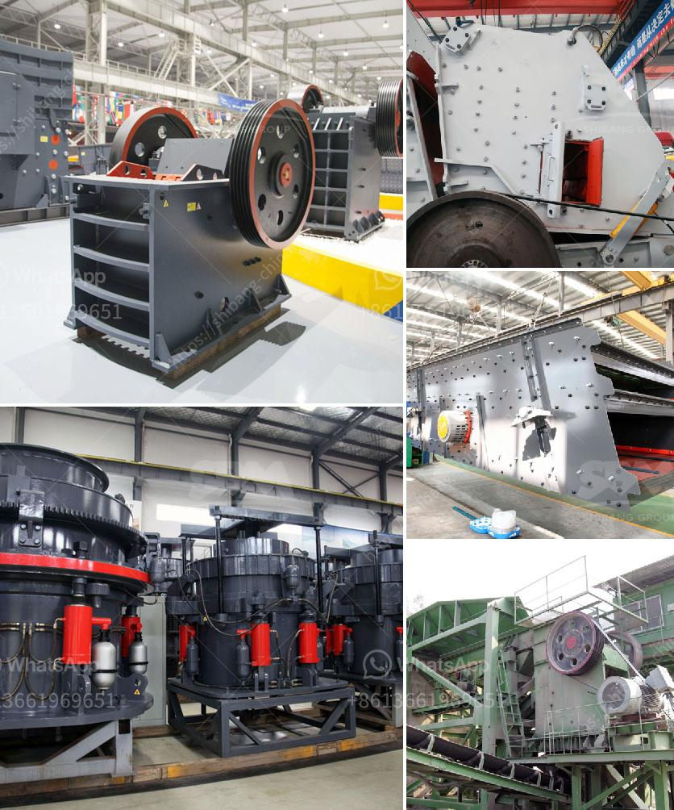

<h3>how to crusher river pebbles into sand ？</h3>
River pebbles are a common type of natural stone found in many places around the world. They are an important raw material for construction projects and have a high market value. Due to their smooth surface, attractive colors, and natural hardness, river pebbles are often used as decorative stones in gardens, pathways, and aquariums. In recent years, the demand for river pebbles as sand has increased significantly. This article will guide you on how to crush river pebbles into sand effectively.

To crush river pebbles into sand, you need to have a crushing equipment combination including a jaw crusher and a cone crusher or impact crusher. The jaw crusher is used for coarse crushing, and the cone crusher or impact crusher is used for medium and fine crushing.

Proper feeding of the river pebbles into the crushing equipment is crucial for efficient crushing. It is recommended to use a vibrating feeder to evenly feed the river pebbles into the jaw crusher. The vibrating feeder ensures a constant and controlled flow of the pebbles into the crushing chamber, preventing clogging and uneven distribution.

Before crushing, it is essential to adjust the settings of the crushing equipment according to the desired output size. The jaw crusher should have a CSS (closed side setting) that allows the river pebbles to be crushed to the desired size. Additionally, the cone crusher or impact crusher should be set to produce the required sand particles.

Start by feeding the river pebbles into the jaw crusher. Utilize the jaw crusher's motor to drive the belt and pulley, which will force the movable jaw to move back and forth. As the movable jaw moves closer to the fixed jaw, the river pebbles will be crushed into smaller sizes. Once the river pebbles reach the desired size, they can be sent to the cone crusher or impact crusher for further crushing.

After crushing, the river pebbles will need to go through a screening process to separate the desired sand particles from any remaining oversized or misshapen pebbles. A vibrating screen or a trommel screen can be used for this purpose. The vibrating or trommel screen will separate the river pebbles into different sizes, ensuring that only the desired sand particles are collected.

Depending on the intended use of the sand, it may be necessary to wash and dry the crushed river pebbles. Washing removes any impurities or unwanted debris from the sand, ensuring a clean and high-quality product. Drying the sand after washing ensures it is ready for use.

In conclusion, crushing river pebbles into sand requires the use of appropriate equipment, efficient feeding, adjustment of settings, and proper screening, washing, and drying processes. By following these steps, one can successfully crush river pebbles into sand that meets the desired specifications. Remember to prioritize safety and always follow the manufacturer's guidelines when operating the crushing equipment.
<h3>Contact us</h3><ul><li><strong>Whatsapp:&nbsp;<a href="https://wa.me/8613661969651">+8613661969651</a></strong></li><li><a href="https://swt.shibang-china.com/?git&amp;zhl&amp;how to crusher river pebbles into sand ？"><strong>Online Service(chat now)</strong></a></li></ul><h3>Related</h3><ul><li><a href='How does bulk density affect the capacity of a rock crusher.md'>How does bulk density affect the capacity of a rock crusher?</a></li><li><a href='How to build iron ore crushing line in Malaysia .md'>How to build iron ore crushing line in Malaysia ?</a></li><li><a href='How to select crushing equipment.md'>How to select crushing equipment?</a></li><li><a href='How to install a secondary crusher.md'>How to install a secondary crusher?</a></li><li><a href='How to install a gyratory crusher 7 steps are critical.md'>How to install a gyratory crusher? 7 steps are critical</a></li></ul>