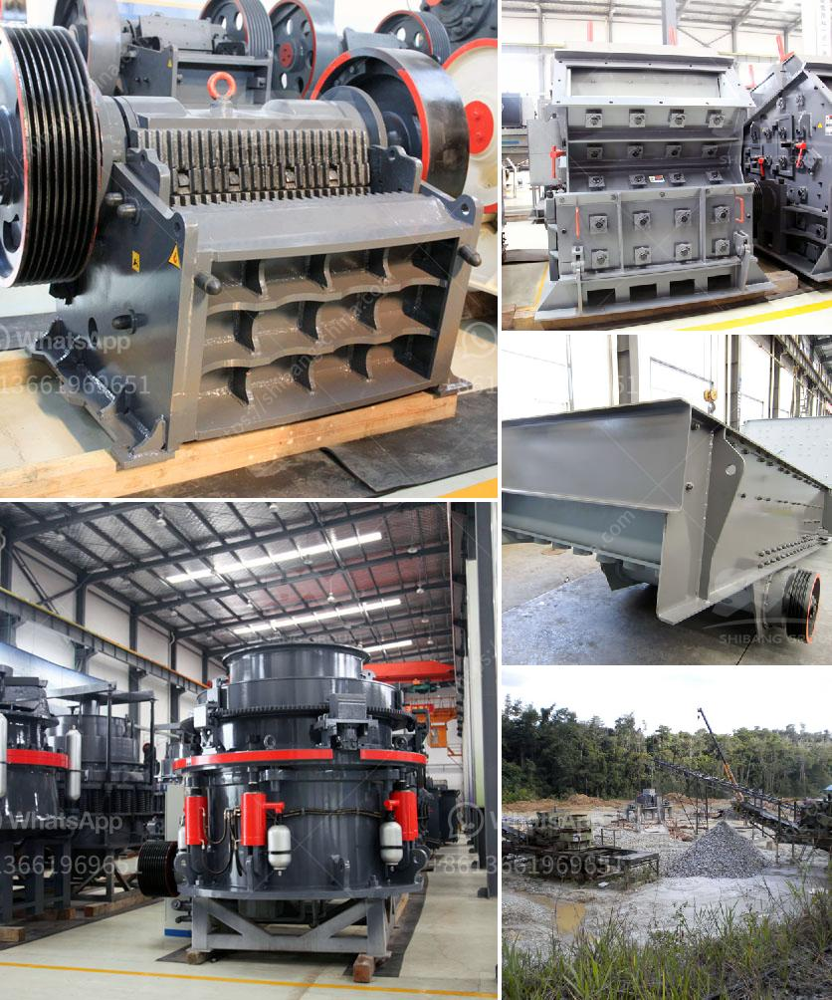

<h3>how to design conveyor belt</h3>
Conveyor belts are widely used in various industries to transport goods and materials from one location to another. Their design plays a crucial role in ensuring efficiency, safety, and reliability. In this article, we will explore the key factors to consider when designing a conveyor belt.

Firstly, it is vital to determine the application's specific requirements. Different industries have unique demands, such as the type and weight of materials to be transported, the speed at which they need to be moved, and the environment in which the conveyor belt will operate. For instance, a conveyor belt used in a mining facility will have different design considerations compared to a belt used in a food processing plant.

The next step is to select the appropriate belt type. Various belt materials are available, including rubber, PVC, metal wire, and fabric. The choice depends on factors such as the nature of the materials being transported, their temperature, and the presence of any corrosive substances. For instance, a rubber belt might be suitable for transporting bulk materials, while a metal wire belt might be more appropriate for high-temperature applications.

The conveyor belt's width is another critical aspect of the design. It should be wide enough to accommodate the size and volume of materials being transported while ensuring the belt does not sag or become overloaded. Additionally, the width should be compatible with the conveyor system layout and any other equipment installed along the belt's path.

Proper belt tension is essential for efficient conveyor operation. The tension must be adjusted to prevent excessive sagging or slipping, ensuring the belt maintains proper contact with the pulleys and rollers. An inadequate tension can result in belt damage or even conveyor malfunctions. Therefore, the design should incorporate mechanisms to adjust and maintain optimal tension throughout the conveyor system.

Inclination and curvature are important factors to consider, especially when dealing with inclined or curved conveyor systems. The design must account for the forces exerted on the belt and ensure it can handle the required angle or curve radius without compromising its performance or causing excessive wear. Introducing cleats, side skirts, or other accessories can aid in maintaining material stability on inclined or curved sections.

Safety is paramount when designing conveyor belts. Adequate guarding and emergency stop systems should be implemented to protect operators and prevent accidents. Additionally, the design should include sensors or detectors to monitor belt alignment, speed, and any potential obstructions. These safety measures can enhance the overall reliability and performance of the conveyor system.

Finally, proper maintenance and inspection procedures should be considered during the design phase. Conveyor belts undergo wear and tear over time, so designing access points for easy maintenance and routine inspections is crucial. This will allow for timely repairs, replacement of worn-out parts, and overall longevity of the conveyor system.

In conclusion, designing a conveyor belt requires careful consideration of specific application requirements, selecting the right belt type, ensuring appropriate belt width and tension, accounting for inclination and curvature, prioritizing safety measures, and planning for proper maintenance procedures. By considering these factors, one can design a conveyor belt that optimizes efficiency, safety, and reliability for various industrial applications.
<h3>Contact us</h3><ul><li><strong>Whatsapp:&nbsp;<a href="https://wa.me/8613661969651">+8613661969651</a></strong></li><li><a href="https://swt.shibang-china.com/?git&amp;zhl&amp;how to design conveyor belt"><strong>Online Service(chat now)</strong></a></li></ul><h3>Related</h3><ul><li><a href='How to Build a Marble Mill ？.md'>How to Build a Marble Mill ？</a></li><li><a href='how to an ore bauxite jaw crusher ？.md'>how to an ore bauxite jaw crusher ？</a></li><li><a href='How does Raymond Mill work.md'>How does Raymond Mill work?</a></li><li><a href='How to crush the very hard iron ore magnetite.md'>How to crush the very hard iron ore magnetite?</a></li><li><a href='How to wash manufacturing sand .md'>How to wash manufacturing sand ?</a></li></ul>