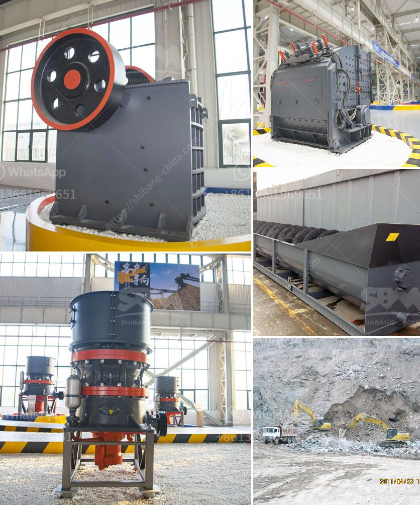

<h3>how to do ball mill liner？</h3>
Ball mill liners are an essential part of any grinding mill. They protect the mill shell from wear and transfer energy to the grinding media. This process is extremely important in achieving the desired grind for any ore or mineral processing application. With proper care and maintenance, ball mill liners can significantly increase the lifespan and efficiency of a mill.

First and foremost, safety should always be the top priority when working on a ball mill liner. Before performing any maintenance or replacement, it is crucial to turn off the power supply, lock out the equipment, and tag it with a warning sign. This ensures that no one operates the machinery while maintenance is being performed.

To begin the process of replacing the ball mill liner, the mill should be empty of materials. Once emptied, the operator can proceed to inspect the interior walls of the mill. The goal is to monitor the condition of the liners and determine if they need to be replaced or if they can be repaired using specialized tools.

When selecting the appropriate liner material, several factors need to be taken into account, including the type of grinding media used, the speed of rotation, and the material being processed. Common materials used for ball mill liners include rubber, alloy steel, and high manganese steel. Each of these materials has its own set of advantages and limitations, so choosing the right one is crucial.

Once the liner material has been chosen, the operator can begin the installation process. It is important to follow the manufacturer's instructions and guidelines during this step. Typically, the liner comes in multiple sections that need to be assembled and bolted to the mill shell. Each section must be aligned correctly and tightened securely to ensure a proper fit.

After the liner is installed, it is essential to monitor its condition regularly. This can be done through visual inspections or using specialized sensors that provide real-time data on wear and performance. By regularly monitoring the liner, any signs of wear or damage can be detected early on, allowing for timely repairs or replacements. This proactive approach can significantly extend the lifespan of the liner and improve the overall efficiency of the ball mill.

In conclusion, ball mill liners are crucial components that protect the mill shell and transfer energy to the grinding media. The process of installing and maintaining these liners should be carried out with the utmost care and attention to safety. By choosing the right liner material and conducting regular inspections, operators can maximize the lifespan and performance of their ball mill liners, ultimately improving the efficiency of their grinding operations.
<h3>Contact us</h3><ul><li><strong>Whatsapp:&nbsp;<a href="https://wa.me/8613661969651">+8613661969651</a></strong></li><li><a href="https://swt.shibang-china.com/?git&amp;zhl&amp;how to do ball mill liner？"><strong>Online Service(chat now)</strong></a></li></ul><h3>Related</h3><ul><li><a href='How to design a cement processing plant.md'>How to design a cement processing plant?</a></li><li><a href='How to eliminate jaw crusher problems during its operation.md'>How to eliminate jaw crusher problems during its operation?</a></li><li><a href='how to install and operate hammer crusher.md'>how to install and operate hammer crusher?</a></li><li><a href='How to increase the productivity of the cone crusher ？.md'>How to increase the productivity of the cone crusher ？</a></li><li><a href='How does a stone crusher work.md'>How does a stone crusher work?</a></li></ul>