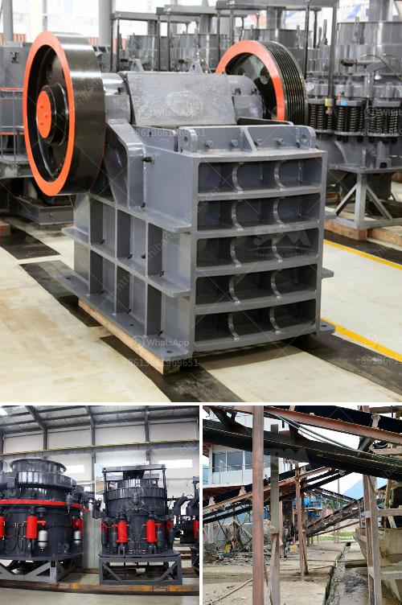

<h3>how to eliminate titaniumsulphur and silica in iron sand？</h3>
Iron sand, a type of iron ore found in coastal areas and river beds, contains impurities such as titanium, sulphur, and silica. These impurities can negatively affect the quality and purity of iron obtained from iron sand. To produce high-quality iron, it is essential to eliminate or minimize the presence of these impurities. In this article, we will discuss some effective methods to eliminate titanium, sulphur, and silica in iron sand.

Magnetic separation is a widely used method to remove impurities from iron sand. Titanium, being a paramagnetic material, can be separated by utilizing its magnetic properties. By applying a strong magnetic field, titanium particles in iron sand can be attracted and separated from iron. This process greatly reduces the titanium content.

Chemical leaching is an effective method for removing sulphur and silica impurities from iron sand. Sulphur impurities can be eliminated by treating the iron sand with a leaching agent such as sodium hydroxide or hydrochloric acid. This process dissolves the sulphur, making it easier to separate from iron sand.

Similarly, silica impurities can be removed by leaching with an alkaline solution or an acidic solution. Alkaline leaching can be performed using sodium hydroxide or sodium carbonate, which reacts with silica to form soluble silicates that can be washed away. Acid leaching, on the other hand, involves treating iron sand with hydrochloric acid or sulfuric acid to dissolve and remove silica.

Froth flotation is another common method used to eliminate impurities in iron sand, including titanium and silica. In this process, a mixture of finely ground iron sand, water, and a flotation agent is agitated to create air bubbles. The air bubbles attach to the impurities, allowing them to float to the surface, while the iron particles sink to the bottom. The impurities can then be skimmed off, leaving behind purified iron sand.

Roasting is a thermal treatment process that can be used to remove sulphur impurities in iron sand. By heating iron sand at high temperatures in the presence of oxygen, sulphur compounds react and convert into gaseous forms such as sulphur dioxide. The gaseous sulphur dioxide can be easily separated, leaving behind iron sand with reduced sulphur content.

High-intensity grinding is a mechanical method that can be employed to break down and remove impurities in iron sand. By subjecting iron sand particles to intense grinding forces, the impurities are fractured and dislodged from the surface of the iron particles. Subsequent magnetic separation or flotation can be used to separate the liberated impurities from iron sand.

In conclusion, eliminating titanium, sulphur, and silica impurities from iron sand is crucial to obtain high-quality iron. Magnetic separation, chemical leaching, froth flotation, roasting, and high-intensity grinding are some effective methods that can be utilized individually or in combination to achieve purified iron sand. It is important to consider the characteristics of the iron sand and the specific impurity being targeted when selecting the appropriate method.
<h3>Contact us</h3><ul><li><strong>Whatsapp:&nbsp;<a href="https://wa.me/8613661969651">+8613661969651</a></strong></li><li><a href="https://swt.shibang-china.com/?git&amp;zhl&amp;how to eliminate titaniumsulphur and silica in iron sand？"><strong>Online Service(chat now)</strong></a></li></ul><h3>Related</h3><ul><li><a href='How to replace the bearing of the jaw crusher machine.md'>How to replace the bearing of the jaw crusher machine?</a></li><li><a href='How to install tunnel feeders in a crushing plant.md'>How to install tunnel feeders in a crushing plant?</a></li><li><a href='How to start a crusher plant in Odisha.md'>How to start a crusher plant in Odisha?</a></li><li><a href='How to check the stone crusher and daily maintenance？.md'>How to check the stone crusher and daily maintenance？</a></li><li><a href='how to load cone crusher .md'>how to load cone crusher ?</a></li></ul>