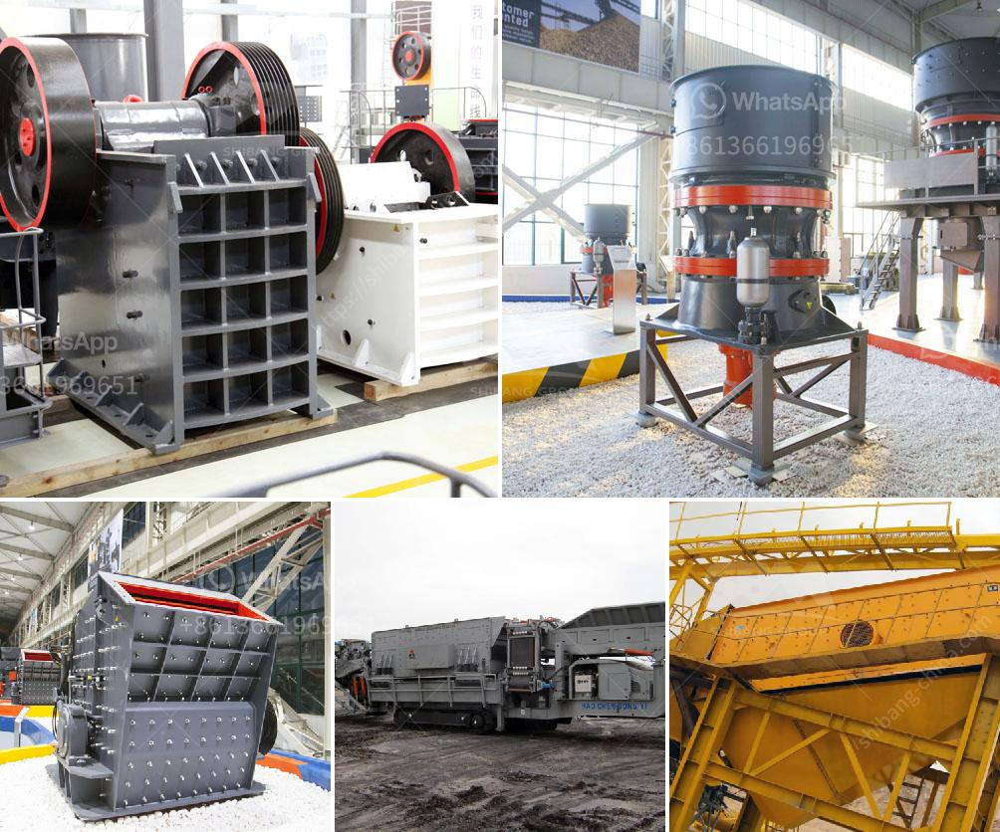

<h3>how to grinder calcium carbonate stone crusher machine?</h3>
Calcium carbonate is a mineral that is commonly used in the manufacturing and production of various materials and products, including paint, plastics, paper, textiles, ceramics, and pharmaceuticals. It is an essential component in many industries due to its versatility and wide range of applications.

One of the key processes in utilizing calcium carbonate is grinding it into a fine powder. This article will guide you on how to use a stone crusher machine to grind calcium carbonate.

To begin with, let's understand the composition of calcium carbonate. It is primarily composed of limestone, a sedimentary rock that is rich in calcium. The limestone is usually extracted from quarries or mines and then processed into various forms such as powder or granules.

The first step in grinding calcium carbonate is the crushing of the limestone. To accomplish this, a stone crusher machine is required. A stone crusher machine is used to crush large-sized rocks into fragments or smaller pieces. The machine has a material inlet where the limestone is fed into the machine, and a rotor with hammers that crush the limestone against the breaker plate for further crushing.

Once the limestone is crushed, it needs to go through a grinding process to produce fine calcium carbonate powder. There are various types of grinding machines available for this purpose, such as Raymond mill, ball mill, and vertical roller mill.

Raymond mill is a widely used grinding machine, especially in mineral processing plants. It has features of high efficiency, low energy consumption, and easy maintenance. The grinding process in a Raymond mill involves rotating blades that transfer the material to a grinding roller. The roller applies pressure to the material, crushing and grinding it into a fine powder.

Ball mills are another common grinding machine used for calcium carbonate grinding. They consist of a rotating cylindrical shell filled with grinding media such as ceramic balls. The material to be ground is fed into the shell, and the rotation of the shell causes the grinding media to crush and grind the material into a fine powder.

Vertical roller mills are used for grinding large quantities of calcium carbonate for industrial applications. They have a vertical arrangement of grinding rollers suspended by springs, which apply pressure to the material. As the grinding rollers rotate, the material is crushed and ground, producing a fine powder.

Once the calcium carbonate is ground into a fine powder, it can be used in various industries according to its particle size. For example, a finer powder is used in pharmaceuticals, while a coarser powder is used in construction materials.

In conclusion, grinding calcium carbonate requires the use of a stone crusher machine to crush and grind the limestone into a fine powder. There are different types of grinding machines available, such as Raymond mill, ball mill, and vertical roller mill, each suitable for specific applications. By following the appropriate grinding process, calcium carbonate can be transformed into a valuable material for various industries.
<h3>Contact us</h3><ul><li><strong>Whatsapp:&nbsp;<a href="https://wa.me/8613661969651">+8613661969651</a></strong></li><li><a href="https://swt.shibang-china.com/?git&amp;zhl&amp;how to grinder calcium carbonate stone crusher machine"><strong>Online Service(chat now)</strong></a></li></ul><h3>Related</h3><ul><li><a href='How to balance cement mill fans.md'>How to balance cement mill fans?</a></li><li><a href='How to start a ballast crushing plant.md'>How to start a ballast crushing plant?</a></li><li><a href='How to grind bentonite clay .md'>How to grind bentonite clay ?</a></li><li><a href='How to prevent environmental pollution in washing plants？.md'>How to prevent environmental pollution in washing plants？</a></li><li><a href='how to produce alternative to river sand ？.md'>how to produce alternative to river sand ？</a></li></ul>