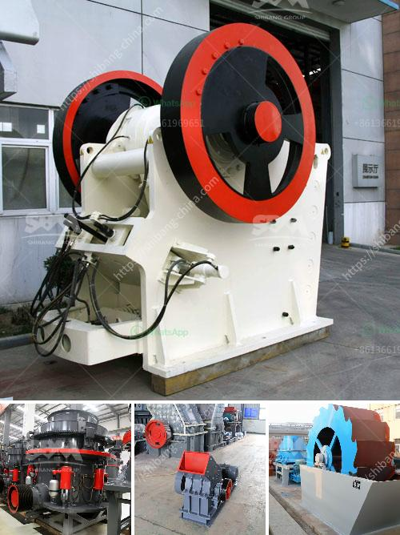

<h3>how to improve the jaw crusher working efficiency？</h3>
A jaw crusher is one of the most commonly used crushing equipment in industrial and mining production. It is mainly used for crushing and coarse crushing of materials with compressive strength no more than 320MPa. The jaw crusher has a large crushing ratio, high efficiency, and uniform product size. However, improper operation or excessive crushing is often the cause of reduced efficiency. In order to improve the jaw crusher working efficiency, we need to analyze the factors affecting the crushing efficiency and take appropriate measures to improve the crushing efficiency.

Improper feeding will affect the working efficiency of the jaw crusher. The uneven distribution of materials in the crushing cavity will cause uneven stress, resulting in reduced crushing efficiency. Therefore, the feeding size should be controlled within the allowable range, and the materials should be evenly distributed in the crushing cavity to ensure the normal operation of the jaw crusher.

The operating conditions of the jaw crusher directly affect its performance and efficiency. In order to ensure the jaw crusher operates at its best, the operator should regularly check the lubrication points of the jaw crusher and add lubricating oil to reduce friction and ensure the normal operation of the machine. Besides, the temperature of the sliding bearing should also be controlled within a reasonable range, and the jaw crusher should be operated at an appropriate speed to avoid excessive wear and reduce energy consumption.

Improving the crushing efficiency of the jaw crusher is an effective way to increase the productivity and reduce the energy consumption. The wear of the jaw plate will affect the crushing efficiency. Therefore, it is necessary to adjust the size of the discharge port regularly and always control the size of the feeding material to reduce the wear of the jaw plate. Additionally, the jaw crusher should be periodically inspected and maintained to repair or replace worn parts in time, ensuring the machine is in good working condition.

The selection of equipment is also important for improving the working efficiency of the jaw crusher. Different types of jaw crushers have different crushing efficiencies and adaptability to materials. Therefore, when selecting equipment, it is necessary to select the appropriate crushing equipment according to the properties of the material to ensure the highest production efficiency.

In summary, the jaw crusher is a commonly used crushing equipment in industrial and mining production. Its working efficiency is related to many factors, including feeding conditions, operating conditions, crushing efficiency, and equipment selection. To improve the working efficiency of the jaw crusher, we need to optimize and continuously improve these factors. By doing so, we can effectively increase the production capacity and reduce energy consumption, ultimately achieving high efficiency and low cost of the jaw crusher.
<h3>Contact us</h3><ul><li><strong>Whatsapp:&nbsp;<a href="https://wa.me/8613661969651">+8613661969651</a></strong></li><li><a href="https://swt.shibang-china.com/?git&amp;zhl&amp;how to improve the jaw crusher working efficiency？"><strong>Online Service(chat now)</strong></a></li></ul><h3>Related</h3><ul><li><a href='How to buy a cone crusher.md'>How to buy a cone crusher?</a></li><li><a href='How much does an iron ore crushing machine cost.md'>How much does an iron ore crushing machine cost?</a></li><li><a href='How does a rock crusher plant work.md'>How does a rock crusher plant work?</a></li><li><a href='How to start stone crusher project.md'>How to start stone crusher project?</a></li><li><a href='How to adjust the discharge opening of an impact crusher.md'>How to adjust the discharge opening of an impact crusher?</a></li></ul>