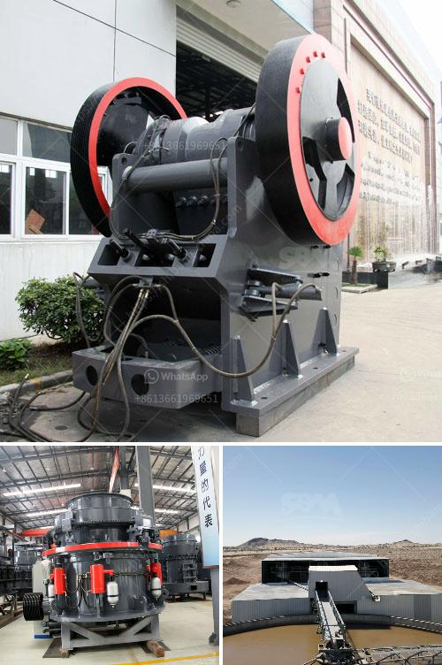

<h3>how to increase efficiency plant of iron ore process？</h3>
Iron ore processing is a critical step in the manufacturing of steel, which is a vital component in many industries. Efficient plant operations can lead to increased production and cost savings. In this article, we will outline some strategies to enhance the efficiency of the iron ore processing plant.

One of the key factors in improving efficiency is optimizing the equipment used in the process. Modern technology offers advanced machinery that can replace older, less efficient equipment. Upgrading to newer mining and processing equipment can result in higher productivity and lower energy consumption, leading to a more efficient plant.

Another way to increase efficiency is through effective process automation. Automation systems can streamline operations by coordinating various tasks and minimizing human intervention. Automated controls and sensors can ensure precise measurement and control of variables like ore composition, moisture levels, and particle size distribution. This enables the plant to operate at optimal conditions, reducing waste and maximizing output.

Regular maintenance and inspection of equipment are essential to ensure continuous and efficient operation. Implementing a comprehensive maintenance program can help identify and address potential issues before they result in costly breakdowns or downtime. Additionally, adopting predictive maintenance techniques, such as condition monitoring or remote diagnostics, can further optimize plant performance by prioritizing maintenance activities and minimizing unplanned shutdowns.

Improving energy efficiency is another critical aspect of increasing plant efficiency. Energy-intensive processes, such as crushing, grinding, and ore transportation, can benefit from energy-saving measures. These can include installing energy-efficient motors and drives, using variable speed controls, and implementing heat recovery systems. Reducing energy consumption not only lowers operational costs but also contributes to a more sustainable operation.

Effective ore beneficiation and sorting techniques can significantly enhance the overall efficiency of the iron ore processing plant. By separating valuable minerals from the ore early in the process, unnecessary material handling and energy consumption can be reduced. Various sorting technologies, such as magnetic separation, flotation, or optical sorting, can be employed to concentrate the desired minerals and reject the unwanted gangue material. This allows for a more streamlined and efficient downstream process.

Lastly, employing data analytics and advanced process control can help identify optimization opportunities and fine-tune production parameters. Real-time monitoring and analysis of process data can provide valuable insights into plant performance, enabling operators to make informed decisions quickly. These technologies can also facilitate continuous process improvement by identifying bottlenecks or inefficiencies that may go unnoticed in manual monitoring.

In conclusion, increasing the efficiency of the iron ore processing plant requires a combination of technology upgrades, automation, maintenance programs, energy-saving measures, and effective ore beneficiation techniques. By adopting these strategies, plant operators can optimize operations, reduce costs, and improve overall productivity. Investing in efficiency improvements not only benefits the bottom line but also contributes to a more sustainable and environmentally friendly operation.
<h3>Contact us</h3><ul><li><strong>Whatsapp:&nbsp;<a href="https://wa.me/8613661969651">+8613661969651</a></strong></li><li><a href="https://swt.shibang-china.com/?git&amp;zhl&amp;how to increase efficiency plant of iron ore process？"><strong>Online Service(chat now)</strong></a></li></ul><h3>Related</h3><ul><li><a href='How does a mobile crushing plant work.md'>How does a mobile crushing plant work?</a></li><li><a href='7 Tips on how to maintain an impact crusher.md'>7 Tips on how to maintain an impact crusher?</a></li><li><a href='How to build crushing plant foundation .md'>How to build crushing plant foundation ?</a></li><li><a href='How to set up artificial sand plant.md'>How to set up artificial sand plant?</a></li><li><a href='How to choose crushing limestone machinery.md'>How to choose crushing limestone machinery?</a></li></ul>