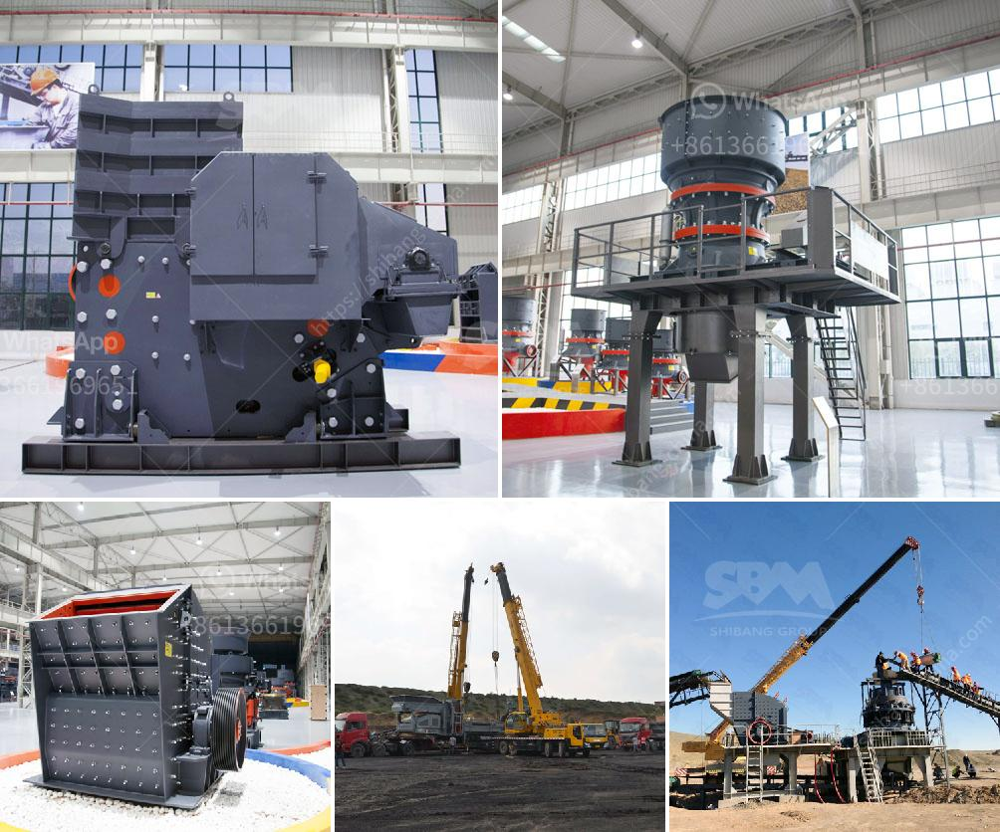

<h3>how to increase is of the output of cement mill ?</h3>
The cement mill plays a crucial role in cement production line and cement production process. Cement grinding aids are the most common cement additives that can significantly improve the grinding efficiency and reduce energy consumption without compromising the performance of cement. In this article, we will discuss some effective strategies to increase the output of a cement mill.

The use of cement grinding aids can greatly improve the grinding efficiency and reduce energy consumption without compromising the performance of cement. Grinding aids are organic compounds that are added to the mill during cement grinding. Their main purpose is to reduce the energy required to grind the clinker into a given fineness, especially for fine grinding. Common types of grinding aids include glycol-based, amine-based, and triethanolamine-based compounds.

There are several key parameters that need to be optimized to enhance the grinding efficiency of a cement mill. These parameters include the ball charge, the filling degree of the mill, the rotational speed, and the ventilation. Increasing the ball charge and filling degree of the mill can improve the grinding capacity and ensure a stable mill operation. Adjusting the rotational speed of the mill can control the grinding efficiency, with higher speeds generally leading to finer grinding. Proper ventilation also plays a significant role in preventing overheating of the mill and maintaining a stable grinding temperature.

Installing high-efficiency separators can greatly enhance the grinding efficiency of a cement mill. High-efficiency separators, also known as “classifiers” or “separators”, are used to separate the ground cement particles from the material flow and to return oversized particles back to the mill for further grinding. These separators utilize centrifugal forces to separate particles of different sizes and densities, ensuring that only the finest particles are discharged as finished product.

Regular maintenance of the cement mill and its associated equipment is crucial for ensuring optimal mill operation and increasing the output. This includes routine inspections, lubrication, cleaning, and the timely replacement of worn-out parts. Additionally, conducting regular mill audits can help identify areas for improvement and opportunities to optimize mill performance.

Upgrading to modern grinding technology can significantly enhance the output and efficiency of a cement mill. Technologies such as vertical roller mills, high-pressure grinding rolls, and advanced control systems offer advantages in terms of efficiency, reliability, and flexibility. Vertical roller mills, for example, have a higher grinding capacity and reduced energy consumption compared to traditional ball mills.

In conclusion, increasing the output of a cement mill can be achieved through a combination of various strategies. The use of cement grinding aids, optimization of the grinding process, installation of high-efficiency separators, regular maintenance, and upgrading to modern grinding technology are all effective measures to enhance mill performance and maximize cement output. Implementing these strategies can lead to significant improvements in both productivity and energy efficiency in cement production.
<h3>Contact us</h3><ul><li><strong>Whatsapp:&nbsp;<a href="https://wa.me/8613661969651">+8613661969651</a></strong></li><li><a href="https://swt.shibang-china.com/?git&amp;zhl&amp;how to increase is of the output of cement mill "><strong>Online Service(chat now)</strong></a></li></ul><h3>Related</h3><ul><li><a href='How to build crushing plant foundation .md'>How to build crushing plant foundation ?</a></li><li><a href='How to start stone crushing business in Ghana .md'>How to start stone crushing business in Ghana ?</a></li><li><a href='How to start a granite quarry.md'>How to start a granite quarry?</a></li><li><a href='How to wash manufacturing sand .md'>How to wash manufacturing sand ?</a></li><li><a href='How to function the cone crusher .md'>How to function the cone crusher ?</a></li></ul>