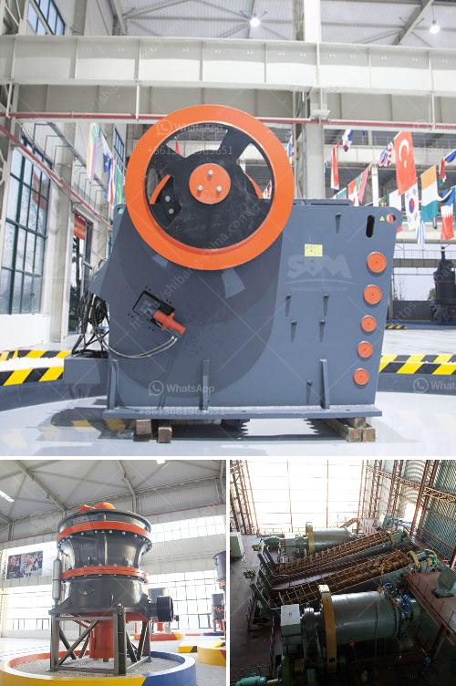

<h3>how to increase life of shaft in jaw crusher？</h3>
The jaw crusher is a versatile crushing device that is used for breaking various rock materials into smaller pieces. Typically, the goal of a jaw crusher is to reduce the size of the rock that comes from the quarry or mine by using a fixed discharge area and a movable jaw plate. However, it is important to remember that the jaw crusher operates under harsh conditions that can put strain on the equipment and wear out the components, such as the shaft.

The shaft in a jaw crusher is responsible for transferring the power generated by the motor to the moving jaw and crush the materials. It is subjected to high mechanical stresses and strains, which can lead to failure or reduced life of the shaft. To increase the life of the shaft in a jaw crusher, it is necessary to maintain proper lubrication, cleanliness, and timely repairs.

One of the most important factors that influence the life of the shaft is lubrication. Adequate lubrication is crucial for reducing friction and wear between the moving parts of the crusher. Insufficient lubrication can lead to metal-to-metal contact, which can cause overheating and premature foaming of the oil, resulting in reduced viscosity and insufficient lubrication. To ensure the proper lubrication of the shaft, regular oil analysis and monitoring should be performed. Additionally, the appropriate type and grade of lubricant should be used, as recommended by the manufacturer.

Aside from lubrication, cleanliness is also crucial in increasing the life of the shaft. Dust, dirt, and debris can accumulate in the crusher and enter the bearings, causing increased wear and additional strain on the shaft. Regular cleaning and maintenance should be conducted to prevent the build-up of unwanted materials. This can be achieved by using compressed air, vacuum cleaners, and other cleaning tools to remove the accumulated residues.

Timely repairs and replacements are equally important in extending the life of the shaft in a jaw crusher. Regular inspections should be conducted to identify any signs of wear, damage, or misalignment in the shaft and associated components. Any issues found during inspections should be immediately addressed to prevent further damage and breakdowns. Timely replacements of worn-out or damaged parts, such as the bearings, seals, and pulleys, should also be carried out to avoid excessive stress and strain on the shaft.

In conclusion, increasing the life of the shaft in a jaw crusher is essential for prolonging the overall life of the equipment and avoiding costly downtime. Proper lubrication, regular cleaning, and timely repairs are key factors in achieving this goal. By following a comprehensive maintenance routine and paying attention to the performance of the crusher, a longer lifespan can be achieved for the shaft and other critical components of the jaw crusher.
<h3>Contact us</h3><ul><li><strong>Whatsapp:&nbsp;<a href="https://wa.me/8613661969651">+8613661969651</a></strong></li><li><a href="https://swt.shibang-china.com/?git&amp;zhl&amp;how to increase life of shaft in jaw crusher？"><strong>Online Service(chat now)</strong></a></li></ul><h3>Related</h3><ul><li><a href='How to choose the useful sand making machine.md'>How to choose the useful sand making machine?</a></li><li><a href='How to buy mobile crusher .md'>How to buy mobile crusher ?</a></li><li><a href='How does a line ball mill working.md'>How does a line ball mill working?</a></li><li><a href='How to calculate the charge volume of a ball mill.md'>How to calculate the charge volume of a ball mill?</a></li><li><a href='How to crush metallurgical coke.md'>How to crush metallurgical coke?</a></li></ul>