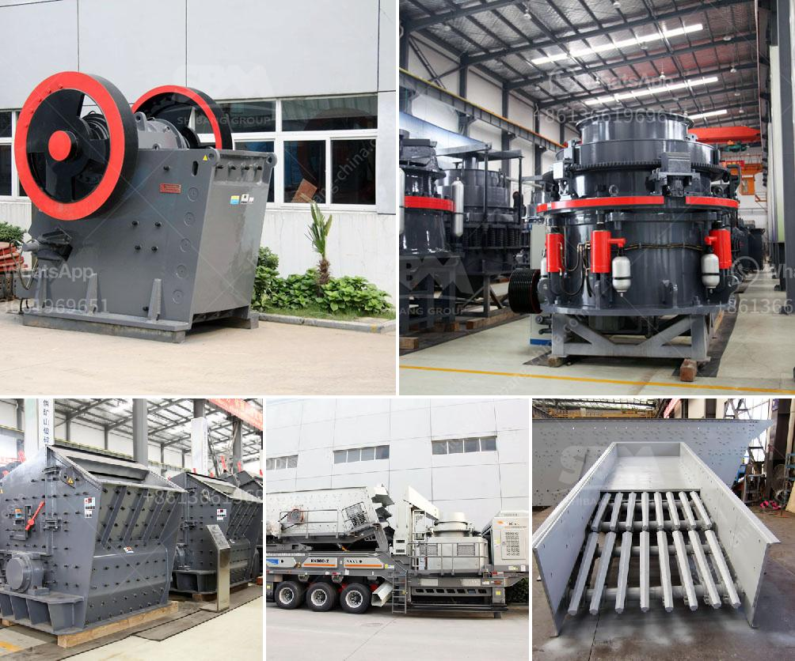

<h3>how to increase production capicity of ball mill?</h3>
Ball mill plays an essential role in the mineral processing production line. So, it is very important to improve the production capacity of ball mill for the users. In order to ensure the normal production of the ball mill, it is essential to improve the production capacity of ball mill accurately. Thus, the requirements of beneficiation operation are realized.

In recent years, the technological advancement of ball mill has been rapid, so the efficiency can be greatly improved. Utilizing such improved technology, we can increase the production capacity of the ball mill effectively. Let's take a closer look at this issue.

1. Change the shape and specifications of the grinding media. Generally, speaking, the bigger the grinding media, the finer the final product particle size is. However, the power consumption of the ball mill is also increasing with the increase of the grinding media weight. This way, we can improve the ball mill's efficiency, but we should pay attention to the substitution ratio.

2. Optimize the internal structure of the ball mill. We can improve the efficiency of the ball mill by optimizing the internal structure of the ball mill. The improvement of the internal structure of the ball mill further helps to reduce energy consumption, and is conducive to the grinding of various materials.

3. Add a high-efficient separator. Adding a high-efficient separator to the ball mill can increase the efficiency of the whole system by 15% to 20%. The internal airflow of the mill is increased, which also helps to improve the grinding efficiency.

4. Replace the liner plate. The new-type liner plate of ball mill can extend the service life of the equipment. Moreover, the retention time of the material in the mill is improved, which not only reduces the over-grinding phenomenon, but also reduces the grind size, and can increase the production capacity of the ball mill.

5. Add appropriate grinding aids. Grinding aids in the ball mill can reduce the energy consumption of the entire grinding process and improve the grinding efficiency. A small amount of grinding aids can not only greatly improve the grinding efficiency, but also increase the content of iron, silicon, and artificial materials in cement, thus improving the quality indicators of cement.

6. Control the moisture and temperature of the material in the mill. The moisture content of the material entering the mill should be controlled within an appropriate range. Too high or too low moisture content will affect the grinding efficiency and increase the energy consumption of the ball mill. The temperature inside the mill also affects its efficiency. The high temperature will cause the mill to terminate due to vibration or spark, which will affect the production capacity of the ball mill.

In conclusion, if we want to effectively increase the production capacity of ball mill, we need to make changes from three aspects - material, water, and equipment. Only by combining these three aspects can we effectively improve the production capacity of ball mill and achieve the desired goal.
<h3>Contact us</h3><ul><li><strong>Whatsapp:&nbsp;<a href="https://wa.me/8613661969651">+8613661969651</a></strong></li><li><a href="https://swt.shibang-china.com/?git&amp;zhl&amp;how to increase production capicity of ball mill"><strong>Online Service(chat now)</strong></a></li></ul><h3>Related</h3><ul><li><a href='How to install a sand making machine.md'>How to install a sand making machine?</a></li><li><a href='How to fit a jaw crusher flywheel.md'>How to fit a jaw crusher flywheel?</a></li><li><a href='How to construct a ramp for a granite crushing plant.md'>How to construct a ramp for a granite crushing plant?</a></li><li><a href='How to change the toggle plate and toggle seat in a jaw crusher.md'>How to change the toggle plate and toggle seat in a jaw crusher?</a></li><li><a href='How to concentrate manganese ore.md'>How to concentrate manganese ore?</a></li></ul>