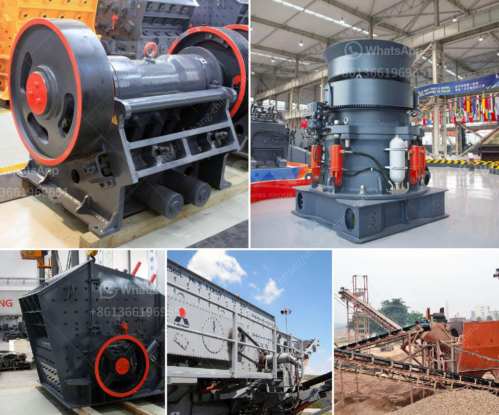

<h3>how to increase the amplitude of vibrating screen ？</h3>
A vibrating screen is a crucial piece of equipment in many industries, including mining, agriculture, and construction. It utilizes vibrations to separate particles and efficiently sieve them based on their size and shape. However, sometimes the amplitude, or the degree of vibration, provided by the vibrating screen may not be sufficient to effectively perform its task. In such cases, it becomes crucial to increase the amplitude of the vibrating screen to enhance its overall efficiency. This article will discuss some effective methods to achieve that.

1. Adjust the eccentric weights: Most modern vibrating screens come equipped with eccentric weights that help generate the required vibration. By adjusting these weights, it is possible to increase the amplitude. Typically, the weights are located at the ends of the vibrator and can be adjusted using a set of bolted or threaded attachments. By adding or removing weight, the eccentricity of the vibrator can be altered, consequently changing the amplitude. However, it is important to ensure that the adjustments are made uniformly on both ends to maintain the screen's balance.

2. Change the angle of inclination: The angle at which the vibrating screen is inclined can significantly impact its amplitude. By adjusting the inclination, the gravitational force acting on the particles increases or decreases, resulting in a change in amplitude. Increasing the angle of inclination can be done by adjusting the support structure or changing the position of the spring mounts. However, it is important to note that altering the angle of inclination too drastically may affect the overall performance and stability of the vibrating screen. Therefore, it is essential to find the optimum angle that provides the desired increase in amplitude without compromising the machine's functionality.

3. Enhance the eccentric force: The eccentricity of a vibrating screen directly impacts its amplitude. Higher eccentric force leads to higher amplitude. To increase the eccentric force, it is possible to install additional drives or increase the RPM (revolutions per minute) of the existing drives. It is essential to consult the manufacturer or an expert to determine the maximum recommended RPM for the specific vibrating screen to avoid damaging the equipment.

4. Proper maintenance: Regular maintenance plays a crucial role in maintaining the optimal performance of a vibrating screen. Over time, components such as springs, bearings, and drive belts may wear out, leading to a decrease in amplitude. Therefore, it is important to conduct routine inspections and replace any worn-out parts promptly. Lubrication is also essential for smooth operation, ensuring that the mechanisms responsible for generating vibrations work optimally.

Increasing the amplitude of a vibrating screen can significantly enhance its productivity and efficiency. By adjusting the eccentric weights, changing the angle of inclination, enhancing the eccentric force, and conducting regular maintenance, operators can achieve the desired increase in amplitude without compromising the overall functionality of the vibrating screen. Furthermore, it is crucial to consult with the manufacturer or an expert before making any significant modifications to ensure optimal and safe operation.
<h3>Contact us</h3><ul><li><strong>Whatsapp:&nbsp;<a href="https://wa.me/8613661969651">+8613661969651</a></strong></li><li><a href="https://swt.shibang-china.com/?git&amp;zhl&amp;how to increase the amplitude of vibrating screen ？"><strong>Online Service(chat now)</strong></a></li></ul><h3>Related</h3><ul><li><a href='How to choose crushing machinery for sand making plant？.md'>How to choose crushing machinery for sand making plant？</a></li><li><a href='How to separate gold from sand with machine .md'>How to separate gold from sand with machine ?</a></li><li><a href='How to process ore in crusher with sticky soil .md'>How to process ore in crusher with sticky soil ?</a></li><li><a href='How does a work of impact crusher.md'>How does a work of impact crusher?</a></li><li><a href='How to buy a cone crusher.md'>How to buy a cone crusher?</a></li></ul>