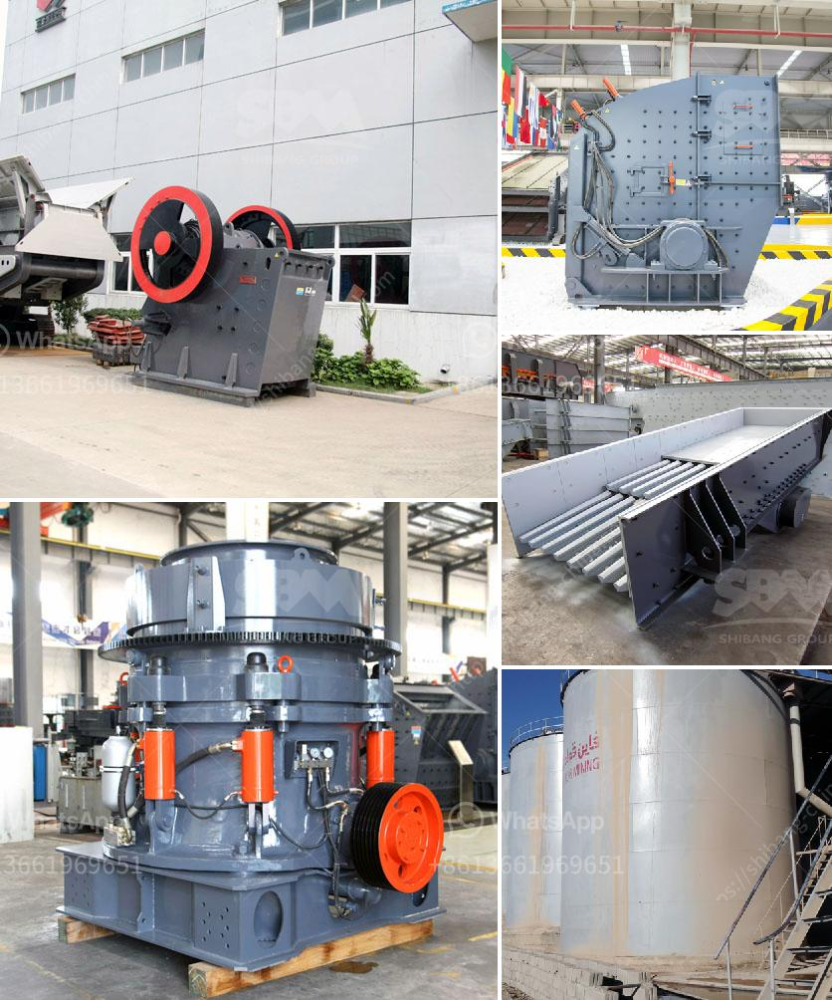

<h3>how to increase vibrating screen capacity ？</h3>
The vibrating screen is an important part of the material screening process in various industries. As the demand for high-quality materials increases, manufacturers are looking for ways to improve the capacity of vibrating screens without compromising their effectiveness. In this article, we will discuss some effective strategies to increase the vibrating screen capacity.

1. Optimize the feeding process: Proper feeding is crucial for maximizing the capacity of a vibrating screen. Uneven feeding can lead to uneven distribution of material on the screen surface, reducing the overall efficiency. To optimize the feeding process, it is essential to ensure a steady and consistent feed rate. Using a feeding hopper with a wider opening can help achieve this. Additionally, removing any material that may be blocking the feed inlet can also contribute to better feeding.

2. Increase screen deck area: Increasing the screen deck area can significantly enhance the capacity of a vibrating screen. By adding more screen panels or increasing the size of existing panels, the effective screening area can be enlarged. This allows for more material to be processed simultaneously, leading to increased throughput and capacity. However, it is important to maintain the proper screen deck tension to ensure effective screening.

3. Adjust screen inclination: The angle at which the vibrating screen is inclined can also affect its capacity. By adjusting the screen inclination, manufacturers can optimize the screening process for different materials and conditions. In general, a steeper inclination increases the material travel speed, improving the screening efficiency. However, it is important to strike a balance as an overly steep inclination may cause material to slide or roll off the screen too quickly, reducing the chances of effective separation.

4. Use high-performance screen media: Choosing the right screen media is crucial for achieving higher capacity. Different types of screen media, such as wire mesh, polyurethane, rubber, or perforated plate, offer different levels of durability, wear resistance, and screening efficiency. Opting for high-performance screen media, such as self-cleaning media or high open area panels, can increase the capacity of a vibrating screen.

5. Optimize vibration parameters: Vibration parameters, such as frequency, amplitude, and direction, play a significant role in determining the capacity of a vibrating screen. By adjusting these parameters, manufacturers can fine-tune the screening process to meet their specific requirements. Increasing the vibration frequency can help segregate smaller particles more effectively, while a larger amplitude can improve the material movement. Additionally, changing the direction of vibration can enhance the material flow on the screen surface.

6. Regular maintenance and inspections: Regular maintenance and inspections are crucial for ensuring the optimal performance and capacity of a vibrating screen. Routine checks for wear and tear, proper tensioning of screen panels, and lubrication of bearings can help prevent any issues that may hamper the capacity. Cleaning the screen surface regularly also contributes to efficient material screening.

By implementing these strategies, manufacturers can increase the capacity of their vibrating screens without compromising their effectiveness. Improving the feeding process, increasing screen deck area, adjusting screen inclination, using high-performance screen media, optimizing vibration parameters, and regular maintenance are all key steps to achieving higher capacity and better material screening.
<h3>Contact us</h3><ul><li><strong>Whatsapp:&nbsp;<a href="https://wa.me/8613661969651">+8613661969651</a></strong></li><li><a href="https://swt.shibang-china.com/?git&amp;zhl&amp;how to increase vibrating screen capacity ？"><strong>Online Service(chat now)</strong></a></li></ul><h3>Related</h3><ul><li><a href='How to choose the right primary crusher for your plant.md'>How to choose the right primary crusher for your plant?</a></li><li><a href='How can we improve cement mill production.md'>How can we improve cement mill production?</a></li><li><a href='How to setting up of stone crusher unit in maharashtra and order there of .md'>How to setting up of stone crusher unit in maharashtra and order there of ?</a></li><li><a href='How do you calculate the motor power for a vibrator screen.md'>How do you calculate the motor power for a vibrator screen?</a></li><li><a href='How to calculate the cemnet grinding aid requirement for cement .md'>How to calculate the cemnet grinding aid requirement for cement ?</a></li></ul>