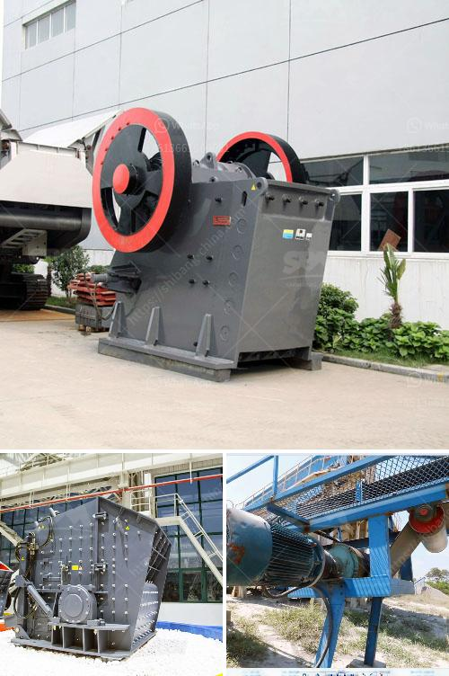

<h3>how to install and operate hammer crusher?</h3>
Hammer crushers are used to crush rocks and debris from quarries, demolitions and excavations, and they are useful for the preparation of bases and related materials. Depending on the product, they are often equipped with a vibration feeder, an impact hammer or a chain, or a jaw or cone crusher. These tools are designed to merge in a single system all the characteristics of professionals with the highest performance and power, making them easier to use and more productive.

Before installing the hammer crusher, examine the foundation for loose materials and ensure it’s suitable for its intended use. Clear the area of any debris, such as rocks or objects that could interfere with the operation. Ensure there is adequate space for the crusher and any associated equipment.

a. Equipment Positioning: Position the hammer crusher in the desired location and level it with shims or adjustable legs.

b. Power Connections: Ensure the power source is appropriate for the crusher and that any necessary electrical connections are made correctly. Follow local electrical codes for safety.

c. Feeder Connection: If your hammer crusher is equipped with a vibration feeder, connect the feeder to the crusher according to the manufacturer's instructions.

d. Conveyor Belt: If the crusher is connected to a conveyor belt, ensure the belt is properly tensioned and aligned. Test the conveyor belt for smooth operation.

e. Lubrication: Check the crusher's lubrication system and add oil if necessary. Follow the manufacturer's recommendations for lubricant type and frequency of application.

a. Startup: Before activating the hammer crusher, make sure all personnel are clear of the crusher and that all safety devices are properly installed and functioning. Start the crusher according to the manufacturer's instructions.

b. Monitoring: During operation, closely monitor the crusher for any abnormal sounds, excessive vibration, or overheating. Address any issues immediately to prevent costly damage.

c. Material Feed: Follow the manufacturer's guidance for the appropriate size and type of material to feed into the crusher. Overloading the crusher can reduce its efficiency and cause damage.

d. Regular Maintenance: Perform routine inspections and maintenance on the crusher to ensure its longevity and optimal performance. This may include cleaning, lubrication, and replacing worn-out parts as needed.

In conclusion, installing and operating a hammer crusher involves careful preparation, proper installation, and diligent operation. Following these steps will help ensure the crusher functions optimally and lasts for years. Always refer to the manufacturer's instructions for specific guidance, and if in doubt, consult with a professional technician for assistance. With these guidelines in mind, you can effectively install and operate a hammer crusher and maximize its productivity in various applications.
<h3>Contact us</h3><ul><li><strong>Whatsapp:&nbsp;<a href="https://wa.me/8613661969651">+8613661969651</a></strong></li><li><a href="https://swt.shibang-china.com/?git&amp;zhl&amp;how to install and operate hammer crusher"><strong>Online Service(chat now)</strong></a></li></ul><h3>Related</h3><ul><li><a href='How to extend the working life of a jaw crushing plate.md'>How to extend the working life of a jaw crushing plate?</a></li><li><a href='How to extract iron efficiently from silica.md'>How to extract iron efficiently from silica?</a></li><li><a href='how does a stone crushing quarry work .md'>how does a stone crushing quarry work ?</a></li><li><a href='How to start a crusher plant in Odisha.md'>How to start a crusher plant in Odisha?</a></li><li><a href='Procedures on how to mine nickel ore .md'>Procedures on how to mine nickel ore ?</a></li></ul>