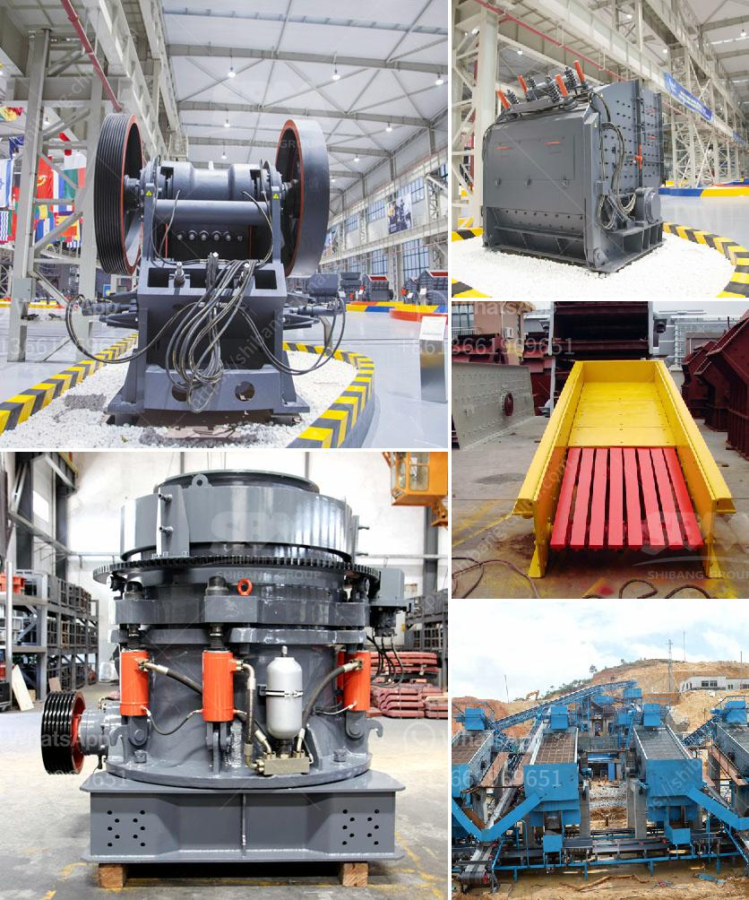

<h3>how to install stone crusher plant ？</h3>
Stone crushing plants are commonly used for crushing stones and hard rocks in construction, mining, and quarrying. Installing a stone crushing plant is indeed an intricate process that requires meticulous planning and execution. However, you can simplify the process by following certain steps that are outlined in this article.

1. Browsing and Selecting a Suitable Plant: A stone crushing plant consists of several components, such as a vibrating feeder, crushers, conveyors, and vibrating screens. You will need to carefully analyze the requirements of the project to ensure that the plant can meet them before proceeding with the purchase.

2. Site Selection: Once you have finalized the plant that suits your needs, the next step is choosing the site for installation. Consider factors such as availability of raw materials, proximity to residential areas, and environmental concerns when selecting the site. Ensure that the site has sufficient space for the plant and its related machinery.

3. Obtaining Required Permits: Depending on your location, you may need to obtain permits and clearances from local authorities. These permits typically include environmental clearances and consent from relevant authorities. It is crucial to comply with all legal requirements to avoid any legal complications in the future.

4. Foundation Construction: The foundation of the stone crusher plant should be laid properly to minimize the vibrations and potential damage to nearby structures. The foundation design generally depends on the soil bearing capacity and the load of the plant. Ensure that there is sufficient space for maintenance and repair work around the plant to enhance safety.

5. Equipment Installation: After the foundation is completed, installing the equipment is the next crucial step. It is advised to hire a professional team experienced in plant installation and commissioning to ensure that everything is set up correctly. Follow the manufacturer's instructions and industry best practices during installation to avoid any inefficiencies or operational issues in the future.

6. Electrical Connectivity: Electrical connections are vital to ensure the proper functioning of the plant. This includes setting up the power supply, wiring the control panels, and connecting the motors and other electrical equipment. A certified electrician should be engaged to handle the electrical work to ensure safety and compliance with electrical regulations.

7. Testing and Commissioning: Once the installation is complete, conduct a thorough inspection and testing of all components of the plant. This will help identify any potential issues and ensure that the plant operates as intended. Run the plant under different operating conditions to gauge its performance and reliability.

8. Safety Measures: Implement adequate safety measures to protect the workers and ensure smooth operations. Provide training to the plant operators on safe working practices and emergency response procedures. Install safety devices such as emergency stop buttons, fire extinguishers, and warning signs as required.

In conclusion, installing a stone crushing plant involves several steps that require careful planning and execution. By following these steps and ensuring compliance with regulatory requirements, you can successfully set up a reliable and efficient stone crushing plant.
<h3>Contact us</h3><ul><li><strong>Whatsapp:&nbsp;<a href="https://wa.me/8613661969651">+8613661969651</a></strong></li><li><a href="https://swt.shibang-china.com/?git&amp;zhl&amp;how to install stone crusher plant ？"><strong>Online Service(chat now)</strong></a></li></ul><h3>Related</h3><ul><li><a href='How to build a small rock crusher.md'>How to build a small rock crusher?</a></li><li><a href='How to design a crushing plant .md'>How to design a crushing plant ?</a></li><li><a href='how vibrating screen works .md'>how vibrating screen works ?</a></li><li><a href='How to cut costs for a quarry.md'>How to cut costs for a quarry?</a></li><li><a href='How to improve the quality of crusher aggregates .md'>How to improve the quality of crusher aggregates ?</a></li></ul>