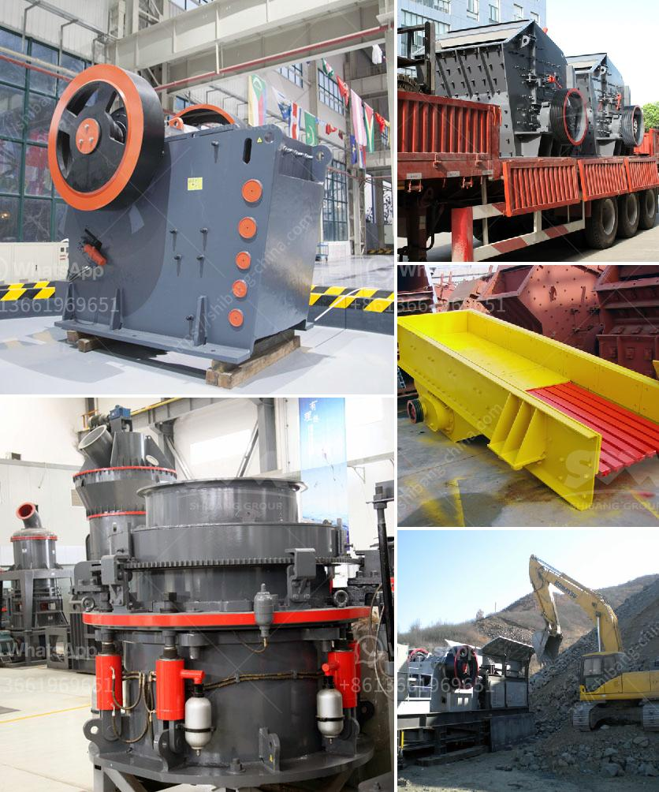

<h3>how to intall a jaw crusher ？</h3>
Installing a jaw crusher is not an easy task, as it requires heavy-duty equipment and expertise in the field. The process of installing a jaw crusher involves several steps that all need to be followed carefully in order to secure the crusher properly and prevent accidents. In this article, we will discuss the process of installing a jaw crusher in detail, providing step-by-step instructions for a safe and efficient installation.

Before installing the jaw crusher, the site needs to be prepared adequately. Clear the area of any obstacles, debris, or equipment that may interfere with the installation process. Ensure that the ground is stable and leveled to provide a solid foundation for the crusher. It is recommended to consult a geotechnical engineer to assess the soil conditions and provide guidance on the foundation requirements.

Carefully assemble all the components of the jaw crusher, following the manufacturer's instructions. This may include the frame, bearings, flywheel, eccentric shaft, toggle plate, and other parts. Make sure to use the appropriate tools and equipment for the assembly process. It is important to handle all parts with care to avoid any damage.

Determine the exact location where the jaw crusher will be installed. Mark the position on the ground and make sure it aligns with any existing equipment or structures. Use a transit or laser level to ensure the crusher is positioned horizontally and vertically. This is crucial for the proper functioning of the crusher and to prevent any unnecessary stress on the components.

Leveling the crusher is essential to ensure its smooth operation. Use shims or adjustable feet to level the crusher properly. Check the level at multiple points across the crusher, including the frame, flywheel, and bearings. Make necessary adjustments until the crusher is leveled and stable.

After leveling the crusher, secure it to the foundation or supporting structure. This can be done by using anchor bolts or steel wedges according to the manufacturer's recommendations. Ensure that the crusher is securely fastened to prevent any movement or vibrations during its operation. This will minimize the risk of accidents and ensure the crusher's stability.

Once the crusher is securely installed, connect the necessary utilities, such as electricity and water, if required. Follow the electrical and plumbing guidelines provided by the crusher manufacturer. It is recommended to consult a professional electrician or plumber for these connections to ensure compliance with safety regulations.

Before putting the jaw crusher into operation, conduct a thorough test to ensure its functionality. Check all the moving parts, lubricate them if necessary, and run the crusher empty for a few minutes to check for any abnormal noises or vibrations. It is important to rectify any issues before proceeding with actual crushing operations.

Installing a jaw crusher requires careful planning, proper equipment, and technical expertise. Following the manufacturer's instructions and safety guidelines is crucial to ensure a successful and safe installation. Consulting professionals, such as geotechnical engineers, electricians, and plumbers, can provide valuable advice and assistance in this process. By diligently following the steps outlined above, a jaw crusher can be properly installed, ready for efficient operation.
<h3>Contact us</h3><ul><li><strong>Whatsapp:&nbsp;<a href="https://wa.me/8613661969651">+8613661969651</a></strong></li><li><a href="https://swt.shibang-china.com/?git&amp;zhl&amp;how to intall a jaw crusher ？"><strong>Online Service(chat now)</strong></a></li></ul><h3>Related</h3><ul><li><a href='how to remove fines from stone crush.md'>how to remove fines from stone crush?</a></li><li><a href='How to install your own jaw crusher？.md'>How to install your own jaw crusher？</a></li><li><a href='How to choose manganese ore crushing machinery.md'>How to choose manganese ore crushing machinery?</a></li><li><a href='How to disassemble a cone crusher.md'>How to disassemble a cone crusher?</a></li><li><a href='how to design conveyor belt.md'>how to design conveyor belt</a></li></ul>