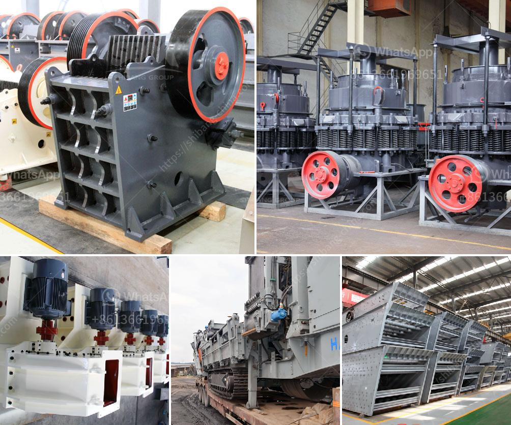

<h3>how to limit excess fines in crushing ?</h3>
Crushing is an essential process in various industries such as mining, construction, and aggregate production. However, one common concern in this process is the generation of excessive fines, which can negatively impact product quality, increase operational costs, and lead to environmental concerns. This article will provide practical tips to limit excess fines in crushing, ensuring efficient production and optimal outcomes.

Investing in the right crushing equipment is crucial to minimizing excessive fines. Consider specific features like adjustable settings, precision control, and the ability to regulate the feed size. Equipment like cone crushers, hammer mills, or impactors with choke feeding capability can significantly reduce fines generation.

Fine generation often occurs due to inappropriate operating parameters. Adjusting the parameters can ensure better control over product size, reducing the production of excessive fines. Proper CSS (closed side setting), aperture sizes, and rotor speed optimization are vital in achieving the desired output with minimal fines.

Maintaining crushing equipment in optimal condition helps prevent excessive fines. Regular inspections, lubrication, and replacement of worn-out parts can improve efficiency, minimize downtime, and control the generation of fines caused by equipment malfunctions.

Excessive moisture in the feed material can cause clumping and increased fines production during the crushing process. Implement measures to control and monitor the moisture content, ensuring it remains within permissible limits. Pre-screening or drying the feed material can be effective in reducing moisture-related issues.

Proper screening techniques are crucial in controlling the amount of fines generated during crushing. A well-designed screening operation removes fines before they reach the crusher, improving overall efficiency and reducing the load on downstream equipment.

Controlling the particle shape during crushing can help in reducing the formation of fines. By utilizing equipment with advanced technologies, such as autogenous crushing or high-speed impact crushing, better control over the particle shape can be achieved, minimizing fines generation.

The generation of excessive fines is often accompanied by the release of dust, which poses environmental and health hazards. Utilize effective dust suppression techniques like water sprays, chemical dust controllers, or enclosure systems to limit dust emission and subsequently reduce fines formation.

Achieving an appropriate gradation of the crushed material is crucial in reducing fines. A well-controlled gradation helps in even distribution of stresses within the material and minimizes particle breakage, resulting in limited fines generation. Fine-tuning the crushing process and adjusting feed materials can achieve desired gradation and reduce fines production.

Minimizing excessive fines during crushing operations is important for various reasons, including enhancing product quality, reducing operational costs, and promoting environmental stewardship. By following these practical tips and implementing appropriate measures, industries can effectively limit excessive fines, ensuring improved efficiency and creating a positive impact on their bottom line.
<h3>Contact us</h3><ul><li><strong>Whatsapp:&nbsp;<a href="https://wa.me/8613661969651">+8613661969651</a></strong></li><li><a href="https://swt.shibang-china.com/?git&amp;zhl&amp;how to limit excess fines in crushing "><strong>Online Service(chat now)</strong></a></li></ul><h3>Related</h3><ul><li><a href='How to improve grinding efficiency of a mill.md'>How to improve grinding efficiency of a mill?</a></li><li><a href='How to increase the productivity of the cone crusher ？.md'>How to increase the productivity of the cone crusher ？</a></li><li><a href='How to use concrete ball mill ？.md'>How to use concrete ball mill ？</a></li><li><a href='How to build a barrel type rock crusher .md'>How to build a barrel type rock crusher ?</a></li><li><a href='How to Use Cone Crusher and Jaw Crusher ？.md'>How to Use Cone Crusher and Jaw Crusher ？</a></li></ul>