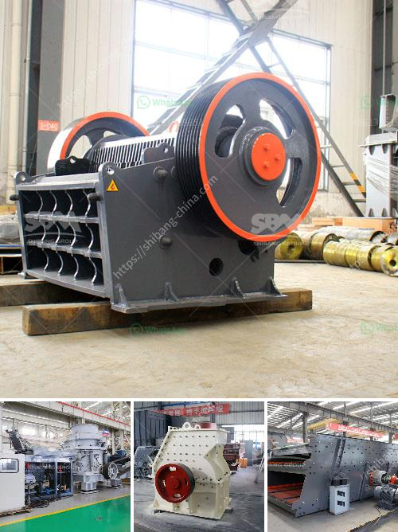

<h3>how to load cone crusher ?</h3>
Cone crushers are versatile machines, used for crushing different materials. They are commonly used in the mining industry, as well as in construction and demolition applications. However, loading a cone crusher properly is often overlooked, leading to various problems in the future. This article will discuss the important steps to follow when loading a cone crusher to optimize its performance and prolong its lifespan.

1. Understand the operating principles: Before loading the cone crusher, it is crucial to have a basic understanding of how the machine works. The cone crusher utilizes compression to crush materials between its concave and mantle surfaces. The concave is fixed, while the mantle moves eccentrically, providing the crushing action. Proper utilization of these surfaces ensures optimal crushing and minimizes wear and tear.

2. Pre-screen materials: Pre-screening the materials before they enter the cone crusher can greatly enhance the crushing process. Pre-screening removes fine particles, which not only increases the overall crushing efficiency but also reduces the risk of overloading the crusher. This step also helps in maintaining a consistent feed size, leading to better product quality.

3. Optimal feeding conditions: To achieve the best results, it is essential to maintain optimal feeding conditions. The maximum feed size for a cone crusher should not exceed 80% of the crusher's opening size. Exceeding this limit can cause higher wear on the cone crusher's liners, resulting in reduced efficiency and increased downtime. Additionally, uneven feeding can lead to uneven wear and lower overall performance.

4. Gradual and even loading: Always load the cone crusher gradually and evenly to prevent overloading. Uniform feeding ensures that the crusher operates at its maximum efficiency, delivers consistent product quality, and minimizes stress on the machine. Avoid sudden increases in feed rate, as they can overload the crusher and potentially damage its components.

5. Control the feed distribution: Distribute the materials evenly across the entire width of the crusher's feed opening. Uneven distribution can cause localized wear and result in an imbalanced crushing process. Adjust the feed distribution by using a vibrating grizzly feeder or controlling the hydraulic feed rate to maintain an even flow of the material.

6. Regular maintenance checks: Once the cone crusher is loaded, it is essential to monitor its performance regularly. Conducting routine maintenance checks, such as checking the oil level, inspecting the crusher's components, and ensuring proper lubrication, helps prevent unexpected breakdowns and ensures optimal operation.

In conclusion, loading a cone crusher properly is crucial for its efficient operation and longevity. Understanding the machine's operating principles, pre-screening the materials, maintaining optimal feeding conditions, and gradually and evenly loading the crusher are key steps to follow. Additionally, controlling the feed distribution and conducting regular maintenance checks contribute to the crusher's overall performance and minimize the risk of downtime. Following these guidelines will help maximize the cone crusher's productivity and extend its service life.
<h3>Contact us</h3><ul><li><strong>Whatsapp:&nbsp;<a href="https://wa.me/8613661969651">+8613661969651</a></strong></li><li><a href="https://swt.shibang-china.com/?git&amp;zhl&amp;how to load cone crusher "><strong>Online Service(chat now)</strong></a></li></ul><h3>Related</h3><ul><li><a href='How to replace a broken bearing in a jaw crusher.md'>How to replace a broken bearing in a jaw crusher?</a></li><li><a href='How to choose a hightechnology and correct mine sand washing machine.md'>How to choose a high-technology and correct mine sand washing machine?</a></li><li><a href='How to build a small cement plant ？.md'>How to build a small cement plant ？</a></li><li><a href='How to Build Your Own Rock Crusher in the Philippines ？.md'>How to Build Your Own Rock Crusher in the Philippines ？</a></li><li><a href='How to improve the output of stone crushing plant .md'>How to improve the output of stone crushing plant ?</a></li></ul>