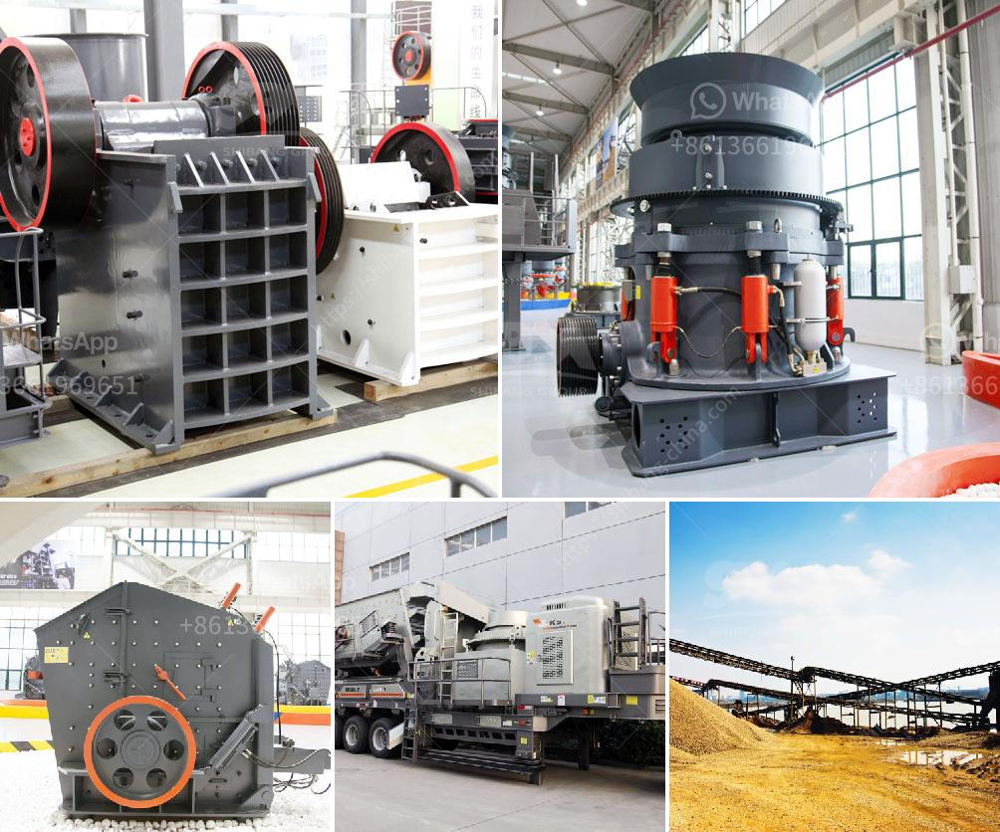

<h3>how to maintain pe 900x600 limestone crusher ？</h3>
Limestone is a common rock that is utilized in various industries for different purposes. One of the primary uses of limestone is in the construction and mining industry. Whether it is used to create aggregates or used as a base material for roads, limestone plays a vital role. The PE 900x600 limestone crusher is a commonly utilized machine that possesses a solid build, enabling it to operate efficiently in various environments.

Regular maintenance is essential for ensuring the longevity and performance of the PE 900x600 limestone crusher. Here are a few key maintenance tips to consider:

1. Lubrication: Proper lubrication is crucial for the optimal performance of any machine. It is recommended to lubricate the crusher's bearings, whether roller or sleeve bearings, regularly. This will prevent excessive wear and tear, reduce the risk of breakdowns, and prolong the lifespan of the machine. Always use the recommended lubricants and follow the manufacturer's guidelines.

2. Cleanliness: Regularly clean the machine to remove any dirt, dust, or debris that may have accumulated. Extreme caution should be exercised while cleaning to prevent any damage to the crusher's components. Use gentle cleaning agents and avoid spraying water directly onto the machine to prevent any electrical hazards.

3. Check for loose parts: Periodically inspect the crusher for loose parts, such as bolts, nuts, or screws. If any parts are found to be loose, tighten them as necessary. Loose parts can cause unnecessary vibrations, which may ultimately lead to equipment failure.

4. Monitor wear parts: The wear parts of the crusher, such as the jaw plates, should be inspected regularly. Worn-out jaw plates can significantly affect the efficiency and performance of the machine. Replace the jaw plates as soon as they show signs of excessive wear and tear.

5. Regularly inspect the belts: Belts play a critical role in the proper functioning of the crusher. Check the belts for any signs of cracks, wear, or damage. Replace damaged belts immediately to prevent unexpected breakdowns. It is essential to adjust the tension of the belts as recommended by the manufacturer to ensure their optimal operation.

6. Conduct regular maintenance checks: In addition to following the aforementioned maintenance tips, it is advisable to conduct regular maintenance checks. These checks can include inspecting electrical connections, checking for leaks, and ensuring the correct functioning of all safety mechanisms. Any issues identified during routine maintenance checks should be addressed promptly.

In conclusion, maintaining the PE 900x600 limestone crusher regularly is vital to ensure its optimal performance, longevity, and cost-effectiveness. By following these maintenance tips, operators can maximize the efficiency of the machine while minimizing downtime and the need for costly repairs. Remember to always adhere to the manufacturer's guidelines and recommendations to get the most out of your crusher.
<h3>Contact us</h3><ul><li><strong>Whatsapp:&nbsp;<a href="https://wa.me/8613661969651">+8613661969651</a></strong></li><li><a href="https://swt.shibang-china.com/?git&amp;zhl&amp;how to maintain pe 900x600 limestone crusher ？"><strong>Online Service(chat now)</strong></a></li></ul><h3>Related</h3><ul><li><a href='how to make stone into powder how much does a grinder cost .md'>how to make stone into powder how much does a grinder cost ?</a></li><li><a href='how does the jaw crusher works.md'>how does the jaw crusher works</a></li><li><a href='how does a grinding cement mill work？.md'>how does a grinding cement mill work？</a></li><li><a href='How to Start a Quarry Crushing Plant in Nigeria Need those crushing machines.md'>How to Start a Quarry Crushing Plant in Nigeria? Need those crushing machines?</a></li><li><a href='How to choose crusher for limestone.md'>How to choose crusher for limestone?</a></li></ul>