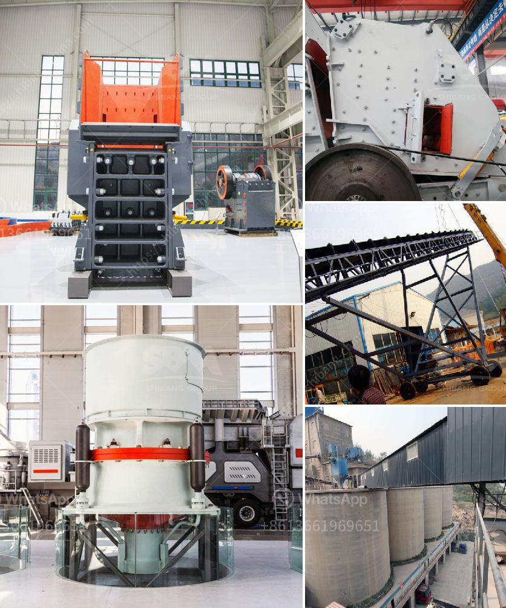

<h3>how to make stone into powder how much does a grinder cost ?</h3>
Stone powder is a versatile material used in various industries such as construction, agriculture, and pharmaceuticals. It is obtained by grinding stones into a fine powder, which can then be used for different purposes. If you are interested in making stone into powder, this article will guide you through the process. Additionally, we will explore the cost of a grinder, an essential tool for achieving the desired consistency.

The first step in making stone into powder is to choose the right type of stone. Different stones have distinct properties, such as hardness and texture, which can impact the fineness of the resulting powder. For example, softer stones like limestone or gypsum are easier to grind compared to harder stones like granite or quartz. Therefore, consider the specific purpose of the powder to determine the suitable stone.

Before grinding the stone, it is crucial to break it into smaller pieces to ensure a smooth grinding process. You can use a hammer or a chisel to break down the stone into manageable chunks. Remember to wear protective gear such as goggles and gloves to avoid any injuries during this process.

Now that the stone is in smaller pieces, it is time to grind it into a fine powder. This can be achieved by using a grinder, which is a machine specifically designed for grinding materials into powder form. While there are various types of grinders available, a high-speed rotary grinder is commonly used for stone grinding.

The cost of a grinder primarily depends on the size, power, and features it offers. Grinders range in price from as low as $20 to a few hundred dollars. For grinding stones into powder, a mid-range grinder priced between $50 and $100 should suffice. However, for industrial-scale operations or specialized purposes, more powerful and expensive grinders may be required.

It is important to consider factors such as durability, warranty, and customer reviews when purchasing a grinder. Research various brands and models to find the one that best suits your needs and budget. Additionally, read the manufacturer's instructions and safety guidelines to operate the grinder safely and efficiently.

In conclusion, turning stone into powder involves selecting the right stone, breaking it down into smaller pieces, grinding it using a suitable grinder, and collecting the resulting powder. The cost of a grinder can vary, but for basic stone grinding purposes, a mid-range grinder priced between $50 and $100 should be sufficient. By following this guide, you can create stone powder for your desired applications effectively and economically.
<h3>Contact us</h3><ul><li><strong>Whatsapp:&nbsp;<a href="https://wa.me/8613661969651">+8613661969651</a></strong></li><li><a href="https://swt.shibang-china.com/?git&amp;zhl&amp;how to make stone into powder how much does a grinder cost "><strong>Online Service(chat now)</strong></a></li></ul><h3>Related</h3><ul><li><a href='how to improve the jaw crusher working efficiency？.md'>how to improve the jaw crusher working efficiency？</a></li><li><a href='How to start stone mining hard rock crusher.md'>How to start stone mining hard rock crusher?</a></li><li><a href='How to set up a ball mill in a cement plant ？.md'>How to set up a ball mill in a cement plant ？</a></li><li><a href='how to design conveyor belt.md'>how to design conveyor belt</a></li><li><a href='How is nickel extracted from its ore.md'>How is nickel extracted from its ore?</a></li></ul>