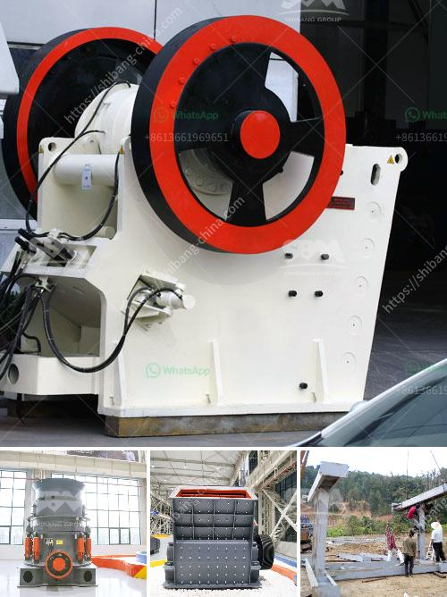

<h3>how to measure methods jaw crusher ?</h3>
When it comes to the field of construction and mining, nothing can beat the importance of a jaw crusher. Jaw crushers are used for crushing heavy stones and rocks into smaller pieces in order to make them suitable for transportation. The size of a jaw crusher is measured by the top opening of the jaws, also known as the gape.

Measuring the gape of a jaw crusher is not an easy task. To measure the gape of a jaw crusher, one would start by measuring the width of the feed opening (gape) and the distance between the stationary and movable jaw plates. This distance is often referred to as the "throw."

The crusher's "throw" is the distance between the swing and fixed jaws at the feed opening. The measurement is made from the top of the tooth of the fixed jaw to the bottom of the tooth of the movable jaw. Often, the measurement can be inaccurate because the jaw liners are worn out, resulting in an uneven surface on the jaws.

To measure the gape of a jaw crusher accurately, it is essential to use a specialized instrument called a jaw crusher gauge. This tool allows the operator to accurately measure the gape of the crusher, ensuring that the correct gap between the jaws is maintained throughout the crushing process.

To use a jaw crusher gauge, the operator needs to place it on the crusher's opening and adjust the jaws until they are parallel to each other. Once the jaws are aligned, the gauge should be placed between them, and the measurement can be noted. This process should be repeated several times to ensure accurate readings.

Measuring the gape of a jaw crusher is crucial because it directly impacts the capacity and efficiency of the crusher. If the gape is too small, the material may not be able to pass through, resulting in inefficient crushing. On the other hand, if the gape is too large, the material may be crushed unevenly, leading to poor product quality.

Regularly measuring the gape of a jaw crusher is especially important when dealing with hard and abrasive materials. As the jaws wear down over time, the gape may change, affecting the size and quality of the crushed product. By monitoring the gape, operators can adjust the crusher settings to maintain optimum performance.

In conclusion, measuring the gape of a jaw crusher is essential for maintaining efficiency and productivity in the construction and mining industries. Using a specialized instrument like a jaw crusher gauge ensures accurate measurements, allowing operators to adjust the crusher settings accordingly. By regularly monitoring the gape, operators can optimize the crushing process and achieve high-quality crushed products.
<h3>Contact us</h3><ul><li><strong>Whatsapp:&nbsp;<a href="https://wa.me/8613661969651">+8613661969651</a></strong></li><li><a href="https://swt.shibang-china.com/?git&amp;zhl&amp;how to measure methods jaw crusher "><strong>Online Service(chat now)</strong></a></li></ul><h3>Related</h3><ul><li><a href='how to choose a portable crusher plant ？.md'>how to choose a portable crusher plant ？</a></li><li><a href='How to calculate the charge volume of a ball mill.md'>How to calculate the charge volume of a ball mill?</a></li><li><a href='How to design an impact crusher.md'>How to design an impact crusher?</a></li><li><a href='How to install a gyratory crusher 7 steps are critical.md'>How to install a gyratory crusher? 7 steps are critical</a></li><li><a href='How to choose a stone crusher station .md'>How to choose a stone crusher station ?</a></li></ul>