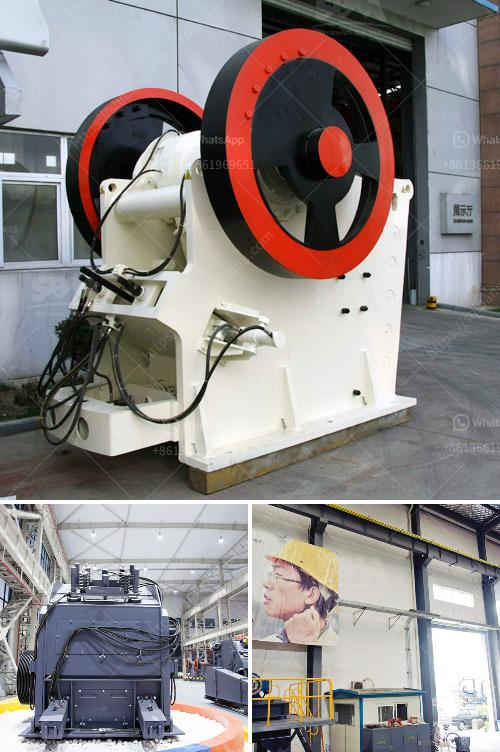

<h3>how to operate of grinding mill equipment？</h3>
Operating grinding mill equipment is an essential task in many industrial processes, such as mineral processing, cement production, power plants, and pharmaceutical industries. A grinding mill is a unit operation designed to break a solid material into smaller pieces. There are various types of grinding mills, including ball mills, vertical roller mills, rod mills, autogenous (AG) and semi-autogenous (SAG) mills.

To successfully operate grinding mill equipment, one must understand the underlying principles and follow the recommended procedures. Here are some key steps to operate grinding mill equipment effectively:

1. Study the equipment: Before using grinding mill equipment, it is important to read the instruction manual and understand its components and functions. Familiarize yourself with the grinding mill's control system, lubrication system, and safety features.

2. Inspect and prepare the mill: Before starting the grinding mill, conduct a thorough inspection to ensure that all parts are in good condition. Check for any loose connections or worn-out components. Also, make sure the mill is clean and free from debris.

3. Pre-grinding preparation: Some materials require pre-grinding before they can be fed into the grinding mill. Ensure that the material is properly prepared, sized, and dried if necessary. This will help to optimize the grinding process and prevent potential issues such as excessive heat generation.

4. Start the mill: Follow the manufacturer's instructions to start the grinding mill equipment. This usually involves activating the mill's motor, lubrication system, and other auxiliary equipment. Ensure that all safety measures are in place, such as wearing protective gear and providing sufficient ventilation.

5. Adjust settings: Once the mill is running, carefully adjust the operational parameters according to the desired output and product specifications. This may include adjusting the speed, feed rate, and grinding media size. Fine-tuning these settings will help to achieve the desired particle size distribution and maximize grinding efficiency.

6. Monitor the process: Maintain a constant vigil on the grinding mill operation. Regularly check the mill's motor, hydraulic system, and temperature readings to ensure smooth and efficient operation. Monitor the product quality and adjust the process parameters if necessary.

7. Preventive maintenance: To ensure long-term reliability and performance, schedule regular maintenance for the grinding mill equipment. This may involve periodic lubrication, inspecting and replacing worn-out parts, and cleaning the mill thoroughly. Following a preventive maintenance plan will extend the equipment's lifespan and minimize unplanned downtime.

8. Shutdown procedures: When you have finished using the grinding mill, follow the manufacturer's recommended procedures to shut down the equipment safely. This may involve stopping the mill's motor, draining any remaining materials, and cleaning the mill thoroughly. Ensure that all safety measures are followed during the shutdown process.

In conclusion, operating grinding mill equipment efficiently requires proper preparation, understanding of the equipment, and adherence to recommended procedures. By following these steps, operators can maximize grinding mill performance, minimize downtime, and produce high-quality products.
<h3>Contact us</h3><ul><li><strong>Whatsapp:&nbsp;<a href="https://wa.me/8613661969651">+8613661969651</a></strong></li><li><a href="https://swt.shibang-china.com/?git&amp;zhl&amp;how to operate of grinding mill equipment？"><strong>Online Service(chat now)</strong></a></li></ul><h3>Related</h3><ul><li><a href='how to start a stone crushing business in USA .md'>how to start a stone crushing business in USA ?</a></li><li><a href='how to start a mini cement mill ？.md'>how to start a mini cement mill ？</a></li><li><a href='How to design a hopper feeder.md'>How to design a hopper feeder?</a></li><li><a href='How to beneficiation tungsten ore.md'>How to beneficiation tungsten ore?</a></li><li><a href='How to start a cone crusher.md'>How to start a cone crusher?</a></li></ul>