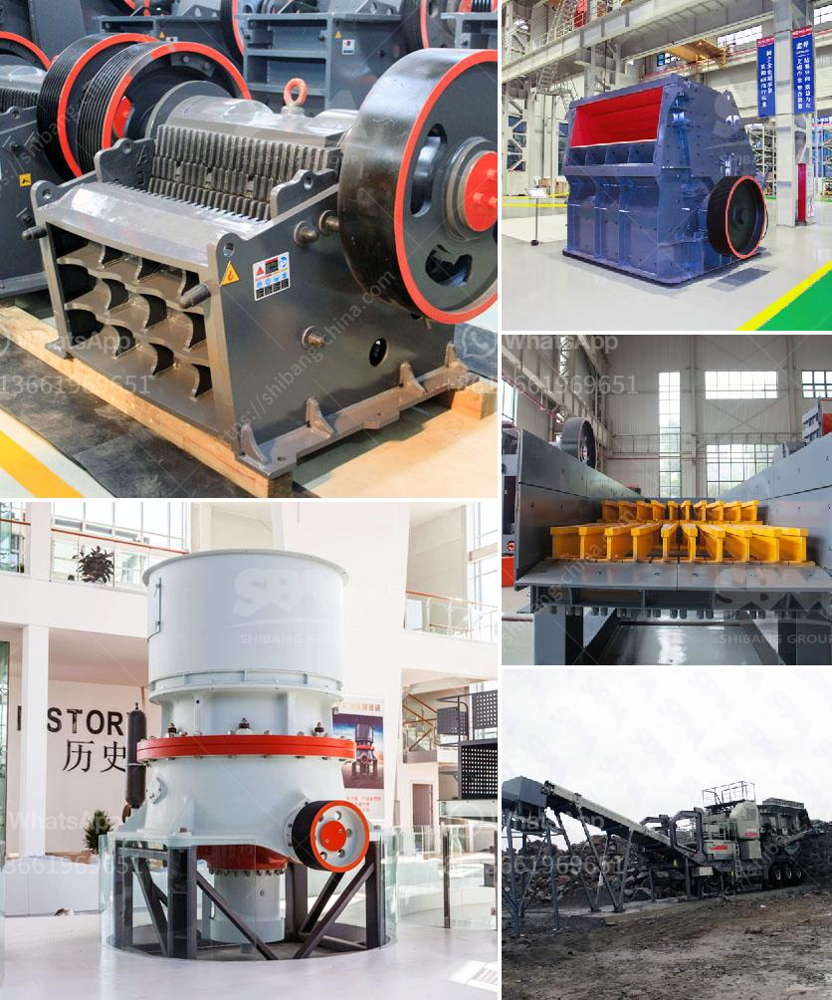

<h3>how to own quarry in nigeria?</h3>
Owning a quarry in Nigeria can be a profitable venture if managed properly. Many entrepreneurs have successfully established quarry businesses and are now reaping the benefits. However, starting and operating a quarry requires a lot of careful planning and management skills. Here are some key steps to consider if you are interested in owning a quarry in Nigeria.

Before diving into the quarry business, conduct thorough market research to identify potential customers, demand for quarry products, and competition in the area. Understanding the market dynamics will help you make informed decisions and develop a solid business plan.

The first step towards owning a quarry is acquiring the appropriate land. Conduct geological surveys to determine the availability of suitable rock deposits. Ensure that the land you intend to use is free from any legal disputes and has the required mineral rights. Acquiring the land can be done through outright purchase, lease, or negotiation with the landowners.

Having technical knowledge and expertise in quarry operations is essential. If you lack the necessary skills, consider partnering with experienced professionals or hiring qualified personnel to help you through the different phases of quarry development and operations. Understanding the technical aspects will ensure that your quarry follows proper mining practices and maximizes productivity.

To operate a quarry legally, you need to obtain the appropriate licenses and permits from the relevant regulatory authorities such as the Mining Cadastre Office, the Department of Petroleum Resources, and the Ministry of Mines and Steel Development. Failure to obtain the necessary permits can lead to fines, closures, and legal problems.

A well-detailed and comprehensive business plan is crucial in securing financing and attracting potential investors. The plan should outline your goals, financial projections, marketing strategies, and operational procedures. It should also include a comprehensive risk assessment and mitigation plan to address potential challenges that may arise.

Quarrying requires substantial capital investment. You may need to seek financial assistance from banks, venture capitalists, or other sources of funding. Presenting a solid business plan and proof of the market potential will greatly improve your chances of securing financing.

Having suitable infrastructure and equipment is vital for the efficient operation of your quarry. This includes necessary machinery, transportation vehicles, storage facilities, and office spaces. Ensure that you have a maintenance plan in place to keep your equipment in optimal working condition.

Complying with health, safety, and environmental regulations is crucial in operating a quarry. Develop policies and procedures to ensure that all employees and contractors adhere to best safety practices to minimize accidents and protect the environment.

Owning a quarry in Nigeria can indeed be a profitable business venture. However, it requires detailed planning, understanding of market dynamics, compliance with regulations, and effective management. By following these steps, you can increase your chances of success in the quarry industry while contributing to the economic growth of Nigeria.
<h3>Contact us</h3><ul><li><strong>Whatsapp:&nbsp;<a href="https://wa.me/8613661969651">+8613661969651</a></strong></li><li><a href="https://swt.shibang-china.com/?git&amp;zhl&amp;how to own quarry in nigeria"><strong>Online Service(chat now)</strong></a></li></ul><h3>Related</h3><ul><li><a href='How to buy rock crusher in Sri Lanka .md'>How to buy rock crusher in Sri Lanka ?</a></li><li><a href='How to set up a quarry business in india.md'>How to set up a quarry business in india?</a></li><li><a href='How to select a jaw crusher.md'>How to select a jaw crusher?</a></li><li><a href='How to fit water pipes on vibrating screen in sand washing plant.md'>How to fit water pipes on vibrating screen in sand washing plant?</a></li><li><a href='How to separate the gold from the powdered sand .md'>How to separate the gold from the powdered sand ?</a></li></ul>