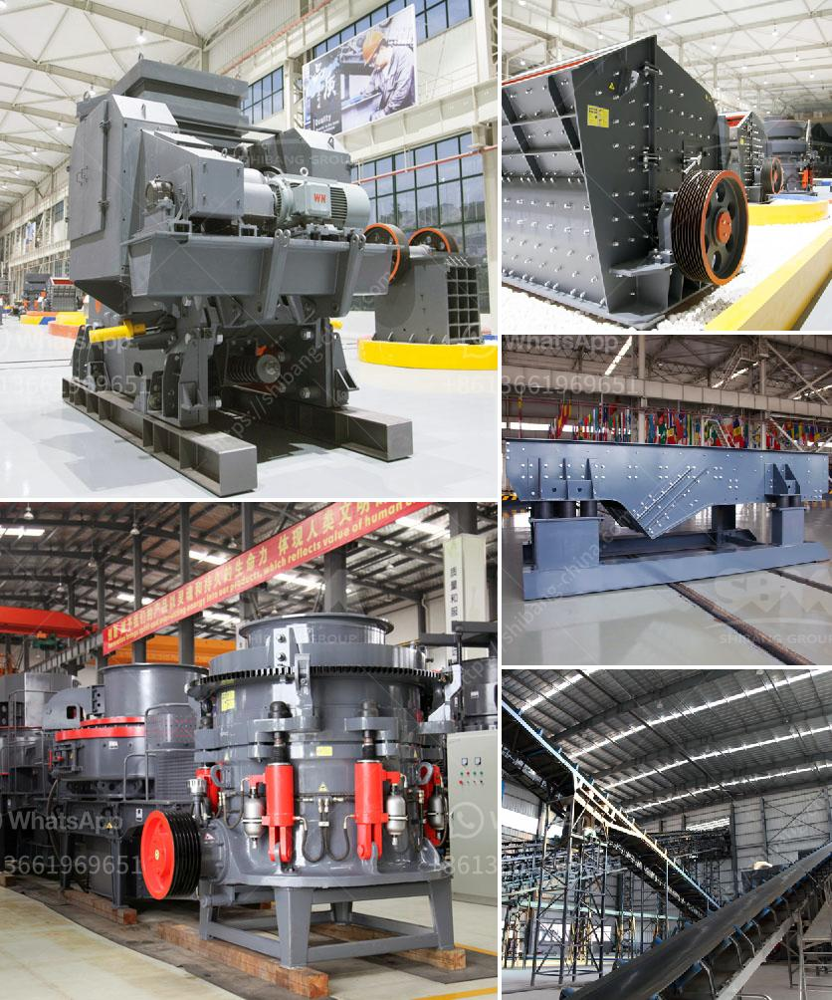

<h3>how to prepare production line of silica sand ？</h3>
Silica sand is a major component in various industries, including glass manufacturing, metal casting, and water filtration. With a wide range of applications, the demand for silica sand continues to grow. To meet this demand efficiently, it is essential to prepare a production line that ensures high-quality silica sand ready for use. In this article, we will discuss the steps involved in preparing a production line for silica sand.

1. Survey and analysis: The first step in setting up a production line is to conduct a survey and analysis of the available resources. This includes determining the quantity and quality of the silica sand deposits. It is crucial to select a location with a sufficient amount of high-grade silica sand, as this will directly impact the efficiency and sustainability of the production process.

2. Mining and extraction: Once a suitable deposit has been identified, the mining and extraction process begins. This involves the use of heavy machinery to remove the topsoil and overburden, revealing the silica sand deposits. Excavators, dump trucks, and bulldozers are commonly used in this stage, ensuring the extraction of the sand with minimal damage to the environment.

3. Washing and sizing: After extraction, the silica sand undergoes a washing and sizing process to remove impurities and sort it into various grades. In this step, water is used to separate the sand from any clay or organic matter. Additionally, screens and classifiers are employed to sort the sand into different sizes, as per the specific requirements of the end-users.

4. Drying and storage: Once the silica sand has been washed and sized, it needs to be dried to reduce moisture content. This is typically done using rotary dryers, which use hot air to remove any remaining water. The dried silica sand is then stored in silos or stockpiles, ready for further processing or packaging.

5. Quality control: Quality control is an essential aspect of preparing a production line for silica sand. Regular testing and analysis must be carried out to ensure that the sand meets the required specifications. This involves conducting chemical and physical tests, such as particle size distribution, acid demand value, and sphericity, to guarantee high-quality silica sand that meets customer expectations.

6. Logistics and transport: Finally, the silica sand needs to be efficiently transported from the production site to its intended destination. This may involve the use of trucks, trains, or ships, depending on the proximity to the end-users. Proper packaging and storage during transit are crucial to prevent contamination or degradation of the silica sand.

In conclusion, setting up a production line for silica sand requires a systematic approach to ensure the efficient extraction, processing, and delivery of high-quality sand. Through careful planning, adherence to quality control measures, and effective logistics management, silica sand can be produced and supplied to meet the growing demand in various industries.
<h3>Contact us</h3><ul><li><strong>Whatsapp:&nbsp;<a href="https://wa.me/8613661969651">+8613661969651</a></strong></li><li><a href="https://swt.shibang-china.com/?git&amp;zhl&amp;how to prepare production line of silica sand ？"><strong>Online Service(chat now)</strong></a></li></ul><h3>Related</h3><ul><li><a href='How to crush drain rock using a crusher.md'>How to crush drain rock using a crusher?</a></li><li><a href='How to write a proposal for a quarry ？.md'>How to write a proposal for a quarry ？</a></li><li><a href='How many kilowatts motor is equipped with jaw crusher ？.md'>How many kilowatts motor is equipped with jaw crusher ？</a></li><li><a href='How can we prevent rocks from coming out of the impact crushers work.md'>How can we prevent rocks from coming out of the impact crusher's work?</a></li><li><a href='how to start a stone crushing business in USA .md'>how to start a stone crushing business in USA ?</a></li></ul>