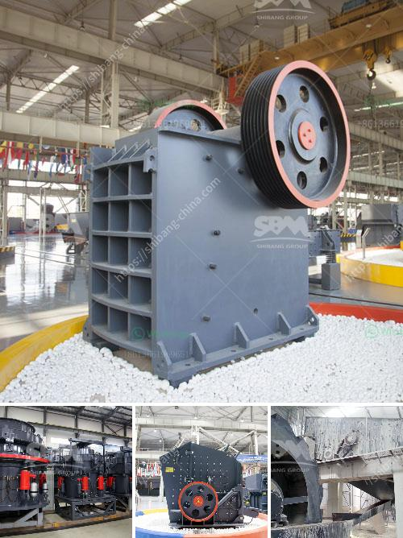

<h3>how to produce alternative to river sand ？</h3>
With the rapidly increasing urbanization and infrastructure development, the demand for river sand has skyrocketed. Unfortunately, the excessive extraction of sand from rivers has led to severe ecological and environmental consequences. Therefore, it is imperative to explore sustainable alternatives to river sand production. This article aims to highlight the importance of finding viable alternatives and explore some innovative methods of producing sustainable substitutes for river sand.

River sand extraction poses numerous environmental hazards. Mining river sand disrupts the natural flow of rivers, leading to erosion of riverbeds, degradation of aquatic habitats, and loss of biodiversity. The excavation of sand also alters the hydrological patterns, resulting in increased flood vulnerability in river basin areas. Additionally, illegal sand mining practices often involve the use of heavy machinery, which contributes to carbon emissions. To mitigate these environmental challenges, it is crucial to find sustainable alternatives to river sand for construction purposes.

Researchers and experts have been exploring various alternatives to river sand to preserve river ecosystems and reduce environmental impact. One emerging solution is the use of manufactured sand or M-sand. M-sand is produced by crushing rocks, which are naturally available in abundance, into fine particles. It possesses similar physical and chemical properties to river sand and meets the requirements for construction purposes. Moreover, it can be successfully used in concrete, plastering, and other construction applications.

Another innovative approach is the utilization of waste materials such as recycled crushed concrete, ceramic waste, and coal ash as alternatives to river sand. These materials can be processed and refined to produce sand-like particles that fulfill the requirements of the construction industry. Recycling such waste materials not only reduces the environmental burden but also helps in conserving natural resources.

The adoption of alternative sand production methods brings numerous benefits. It curtails the dependence on river sand, reducing the chances of environmental degradation caused by excessive extraction. Additionally, the use of alternative sands mitigates the impact on river ecosystems and aids in preserving the natural flow of water, which is crucial for sustaining aquatic life and preventing flooding. By utilizing waste materials, the construction industry can contribute to waste reduction and promote circular economy practices.

The need for minimizing the environmental impact of sand extraction has become more critical than ever before. By embracing sustainable alternatives to river sand, we can protect valuable ecosystems, reduce carbon emissions, and promote the responsible use of natural resources. Utilizing manufactured sand and waste materials as substitutes not only meets construction standards but also aids in shifting towards a more sustainable construction industry. With collaborative efforts from researchers, policymakers, and stakeholders, we can strive towards a greener future by reducing our reliance on river sand and adopting sustainable alternatives.
<h3>Contact us</h3><ul><li><strong>Whatsapp:&nbsp;<a href="https://wa.me/8613661969651">+8613661969651</a></strong></li><li><a href="https://swt.shibang-china.com/?git&amp;zhl&amp;how to produce alternative to river sand ？"><strong>Online Service(chat now)</strong></a></li></ul><h3>Related</h3><ul><li><a href='how to separate iron from basalt？.md'>how to separate iron from basalt？</a></li><li><a href='How to install impact crusher .md'>How to install impact crusher ?</a></li><li><a href='How to weld the broken jaw plate of jaw crusher.md'>How to weld the broken jaw plate of jaw crusher?</a></li><li><a href='How to extract silver from lead ore ？.md'>How to extract silver from lead ore ？</a></li><li><a href='How to set up a ball mill in a cement plant ？.md'>How to set up a ball mill in a cement plant ？</a></li></ul>