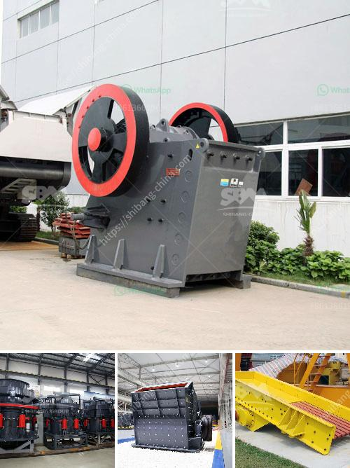

<h3>how to pulverized limestone crusher ？</h3>
Limestone is a natural resource that is widely used in various industries, including construction, metallurgy, and chemical engineering. To meet the demand for high-quality limestone products, it is essential to pulverize the raw limestone materials to achieve the desired particle size.

The primary tool used to pulverize limestone is a crusher. However, choosing the right limestone crusher can be a challenging task, especially if you are unfamiliar with the different types of crushers available today. In this article, we will explore the factors to consider when selecting a limestone crusher.

Before choosing a limestone crusher, it is crucial to determine your production requirements. Consider factors such as the required output size, capacity, and the specific applications of the crushed limestone. This information will help you select the crusher that best suits your needs.

There are several types of crushers available for pulverizing limestone, each with its own unique features and benefits. The commonly used types of crushers for limestone are jaw crushers, impact crushers, and cone crushers. Jaw crushers are primarily used for coarse crushing, while impact crushers and cone crushers are commonly used for secondary and tertiary crushing.

When selecting a limestone crusher, it is essential to consider the materials and wear parts used in the crusher's construction. Opting for a crusher made from high-quality materials will ensure its durability and longevity. Additionally, choosing crushers with easily replaceable wear parts will minimize downtime and maintenance costs.

Efficiency is a critical factor to consider when selecting a limestone crusher. A highly efficient crusher will maximize the production output while minimizing energy consumption. Look for crushers with advanced technologies such as hydraulic systems and variable speed drives, as these features can significantly improve the crusher's efficiency.

Safety should be a top priority when choosing a limestone crusher. Look for crushers with safety features such as safety guards, emergency stop buttons, and automatic overload protection. These features will not only protect the operators but also prevent damage to the crusher and other equipment.

Regular maintenance is essential for the proper functioning and longevity of a limestone crusher. Before selecting a crusher, assess its maintenance requirements. Look for crushers with easy access to the internal components and minimal downtime for maintenance tasks.

In conclusion, choosing the right limestone crusher for your project requires careful consideration of various factors. By determining your production requirements, understanding the different types of crushers available, and considering factors such as materials, efficiency, safety features, and maintenance requirements, you can make an informed decision. Remember to consult with professionals or seek expert advice to ensure you choose the most suitable limestone crusher for your specific needs.
<h3>Contact us</h3><ul><li><strong>Whatsapp:&nbsp;<a href="https://wa.me/8613661969651">+8613661969651</a></strong></li><li><a href="https://swt.shibang-china.com/?git&amp;zhl&amp;how to pulverized limestone crusher ？"><strong>Online Service(chat now)</strong></a></li></ul><h3>Related</h3><ul><li><a href='How the mechanism sand is produced .md'>How the mechanism sand is produced ?</a></li><li><a href='How to crush metallurgical coke.md'>How to crush metallurgical coke?</a></li><li><a href='How to install impact crusher .md'>How to install impact crusher ?</a></li><li><a href='How is dolomite crushed for road building etc.md'>How is dolomite crushed for road building, etc.?</a></li><li><a href='How to extend the working life of a jaw crushing plate.md'>How to extend the working life of a jaw crushing plate?</a></li></ul>