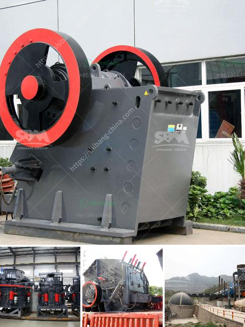

<h3>how to realize the feeding control of raymond mill ?</h3>
Raymond mill plays a crucial role in the milling industry, and its feeding control directly affects the grinding efficiency and product quality of the mill. Therefore, it is essential to master the correct method of feeding control for Raymond mill. In this article, we will discuss some important aspects of feeding control to help you improve the operation of your Raymond mill.

Before discussing feeding control, it is essential to understand the working principle of Raymond mill. Raymond mill primarily consists of the main engine, analyzer, fan, finished cyclone separator, and duct. The main engine drives the grinding roller to rotate through the transmission device, and the material is fed into the grinding chamber through the feeding device. The grinding roller and grinding ring generate a grinding force, which grinds the materials. The qualified powder is collected by the analyzer, and the remaining unqualified powder is returned to the grinding chamber for re-grinding.

One crucial aspect of feeding control is regulating the moisture content of the material being fed into the Raymond mill. Excessive moisture in the material can cause clogging, affecting the mill's grinding efficiency. Therefore, it is necessary to control the material moisture within a reasonable range. If the material is too wet, it should be dried before entering the Raymond mill.

The feeding speed determines the amount of material that enters the Raymond mill per unit time. It directly affects the grinding efficiency of the mill. If the feeding speed is too fast, the material cannot be fully ground, leading to low grinding efficiency. On the other hand, if the feeding speed is too slow, the grinding chamber may be blocked, resulting in material accumulation and reduced productivity. Therefore, it is necessary to adjust the feeding speed according to the specific grinding requirements and the material properties.

Uniform feeding can effectively improve the grinding efficiency of Raymond mill. It helps maintain a stable material layer on the grinding disc, ensuring that the grinding force is evenly distributed. To achieve uniform feeding, it is recommended to use a feeder to control the feeding amount and ensure a stable and continuous material supply.

To ensure the feeding control of Raymond mill, it is crucial to regularly check and maintain the feeding system. This includes inspecting the feeding device, feeder, and related components for any damage or wear. If any issues are found, they should be repaired or replaced promptly to avoid affecting the feeding control of the mill.

In conclusion, mastering the feeding control of Raymond mill is essential for improving grinding efficiency and product quality. By understanding the working principle, controlling material moisture, adjusting feeding speed, ensuring uniform feeding, and regularly maintaining the feeding system, you can optimize the operation of your Raymond mill and achieve better milling results.
<h3>Contact us</h3><ul><li><strong>Whatsapp:&nbsp;<a href="https://wa.me/8613661969651">+8613661969651</a></strong></li><li><a href="https://swt.shibang-china.com/?git&amp;zhl&amp;how to realize the feeding control of raymond mill "><strong>Online Service(chat now)</strong></a></li></ul><h3>Related</h3><ul><li><a href='How does Raymond Mill work.md'>How does Raymond Mill work?</a></li><li><a href='How to separate gold from sand with machine .md'>How to separate gold from sand with machine ?</a></li><li><a href='how to use jaw and impact crusher.md'>how to use jaw and impact crusher</a></li><li><a href='how to calculate the processing capacity of the mill .md'>how to calculate the processing capacity of the mill ?</a></li><li><a href='How to buy mobile crusher .md'>How to buy mobile crusher ?</a></li></ul>