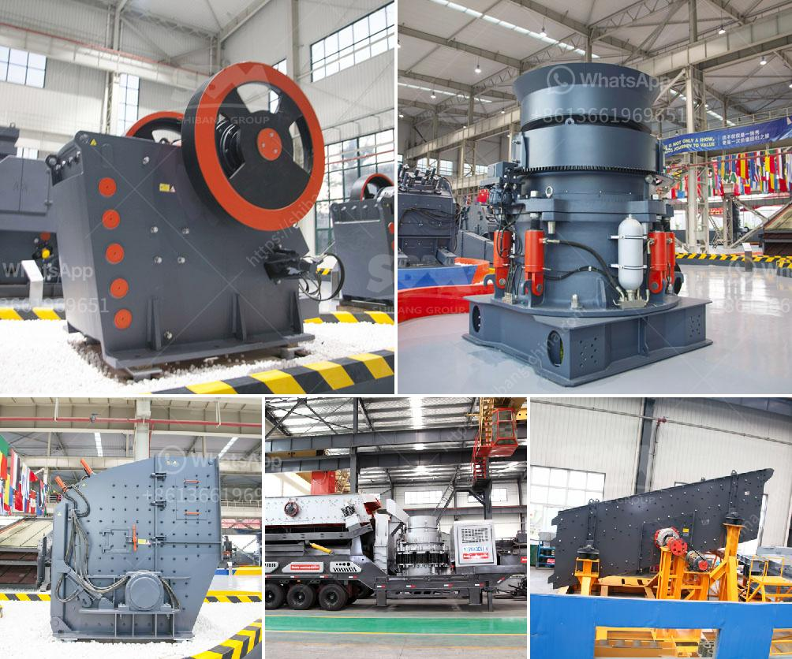

<h3>how to rebuild cone crusher ?</h3>
Cone crushers are widely used in various crushing applications, including mining, quarrying, and recycling. They are used in the process of reducing larger-sized material into smaller-sized material for further processing. However, cone crushers can suffer from wear and tear over time, leading to the need for rebuilds and repairs. This article will outline the step-by-step process of how to rebuild a cone crusher, ensuring its optimal performance and prolonging its lifespan.

The first step in the rebuilding process is to dismantle the cone crusher. Start by carefully removing the protective covers and guarding, followed by the outer and inner eccentric shaft sleeves, bearings, socket liners, and eccentric bushing. Keep all the components organized and labeled to ensure easy reassembly.

Once the cone crusher is disassembled, thoroughly inspect all the components for any signs of wear, damage, or excessive axial play. Pay close attention to the main shaft, feed plate, socket liners, eccentric bushing, and other critical components. Consider replacing any parts that are worn beyond acceptable limits to ensure optimum performance and prevent future breakdowns.

After inspecting the components, clean them thoroughly using a degreaser and water. Remove any built-up dirt, grease, or debris that may affect the performance of the cone crusher. Use a soft brush or a cloth to clean hard-to-reach areas. Ensure all the components are completely dry before moving on to the next step.

Begin the reassembly process by carefully installing the refurbished or new eccentric bushing, socket liner, and bearings. Apply a thin layer of lubricant to the mating surfaces and ensure they are properly aligned. Use the manufacturer's recommended torque specification for tightening all the fasteners to prevent excessive stress on the components.

Once the cone crusher is reassembled, it is crucial to balance the rotating assembly for optimum performance and bearing longevity. Use a precision balancing machine to determine the correct weight distribution. Add or remove balancing weights as necessary until achieving the desired balance.

After the rebuild process is complete, it is essential to thoroughly test the cone crusher's performance before putting it back into operation. Run the crusher empty for a short period to ensure there are no abnormal vibrations or noises. Gradually introduce feed material to the crusher while monitoring its performance, ensuring proper crushing and discharge.

To prevent the need for frequent rebuilds, it is essential to perform regular maintenance on the cone crusher. This includes regular inspections, lubrication, and timely replacement of wear parts. Follow the manufacturer's maintenance recommendations to ensure the cone crusher operates at its best and prolong its service life.

In conclusion, rebuilding a cone crusher is a meticulous process that requires careful attention to detail. By following the step-by-step guide outlined above, you can successfully rebuild your cone crusher and ensure its optimal performance and long lifespan. Remember to always consult the manufacturer's guidelines and seek professional assistance if needed.
<h3>Contact us</h3><ul><li><strong>Whatsapp:&nbsp;<a href="https://wa.me/8613661969651">+8613661969651</a></strong></li><li><a href="https://swt.shibang-china.com/?git&amp;zhl&amp;how to rebuild cone crusher "><strong>Online Service(chat now)</strong></a></li></ul><h3>Related</h3><ul><li><a href='How to analyze the critical frequency of a vibrating screen.md'>How to analyze the critical frequency of a vibrating screen?</a></li><li><a href='How To Build Your Own Rock Crusher Plant？.md'>How To Build Your Own Rock Crusher Plant？</a></li><li><a href='How to select ball mill.md'>How to select ball mill?</a></li><li><a href='How to move and install a mobile rock crusher.md'>How to move and install a mobile rock crusher?</a></li><li><a href='how to prepare production line of silica sand ？.md'>how to prepare production line of silica sand ？</a></li></ul>