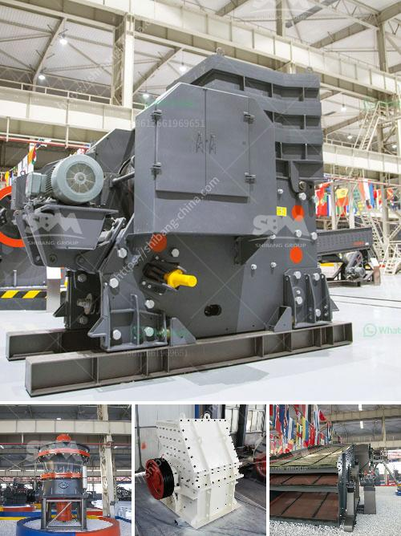

<h3>how to remove fines from stone crush?</h3>
Stone crush fines, also known as crusher dust or quarry dust, are the byproducts generated during the production of crushed stones. These fines are commonly used as fillers in various construction projects, such as roads, highways, and buildings. While the use of stone crush fines provides economic and environmental benefits, their removal can be a challenging task. In this article, we will explore effective methods to remove fines from stone crush, ensuring its optimal usage and quality.

One of the most common methods to remove fines from stone crush is through screening. A vibrating screen or a sieve can be used to separate the fines from the larger particles. This process relies on the size differences between the fines and the aggregates. The mesh size of the screen can be adjusted based on the desired particle size distribution. By carefully adjusting the screen parameters, fines can be efficiently separated from the stone crush.

Another effective method to remove fines from stone crush is through washing. This process involves spraying water onto the crushed stones and using water pressure to dislodge the fines. The water carries the fines away, leaving behind clean aggregates. However, washing can be a time-consuming process, especially if a large quantity of stone crush fines needs to be removed. Additionally, careful consideration should be given to the environmental impact of water usage and disposal.

Utilizing settling tanks is a viable option for removing fines from stone crush. Settling tanks work on the principle of gravity, allowing the fines to settle at the bottom while the larger aggregates float or remain suspended. By controlling the flow rate and retention time, the majority of the fines can be separated from the stone crush. However, settling tanks can require significant space and may not be suitable for all construction sites.

In some cases, air classification can be employed to remove fines from stone crush. This method utilizes airflow to separate the lighter fines from the heavier aggregates. When the crushed stones are fed into an air classifier, the fines are carried by the air current and collected separately, leaving behind the clean aggregates. Air classification is efficient and can offer a continuous separation process. However, it may require additional equipment and energy for the air movement.

Electrostatic separation is an advanced method that can effectively remove fines from stone crush. This technique utilizes electrical charges to selectively attract and separate the fines. By applying a high voltage to the crushed stones, the fines can be positively or negatively charged, allowing them to be separated from the aggregates. Electrostatic separation offers high precision and purity but can require specialized equipment and expertise.

In conclusion, removing fines from stone crush is crucial to ensure its optimal usage and quality in various construction projects. Screening, washing, settling tanks, air classification, and electrostatic separation are effective methods for this purpose. Each method has its advantages and disadvantages, so the choice should be based on the specific requirements of the project. By employing these techniques carefully, the fines can be efficiently removed, providing clean and high-quality stone crush for construction applications.
<h3>Contact us</h3><ul><li><strong>Whatsapp:&nbsp;<a href="https://wa.me/8613661969651">+8613661969651</a></strong></li><li><a href="https://swt.shibang-china.com/?git&amp;zhl&amp;how to remove fines from stone crush"><strong>Online Service(chat now)</strong></a></li></ul><h3>Related</h3><ul><li><a href='How does a jaw crusher crush limestone.md'>How does a jaw crusher crush limestone?</a></li><li><a href='How iron ore is mined.md'>How iron ore is mined</a></li><li><a href='How to make a foundation for sand crusher.md'>How to make a foundation for sand crusher?</a></li><li><a href='how to increase production capicity of ball mill.md'>how to increase production capicity of ball mill?</a></li><li><a href='How do belt conveyors work.md'>How do belt conveyors work?</a></li></ul>