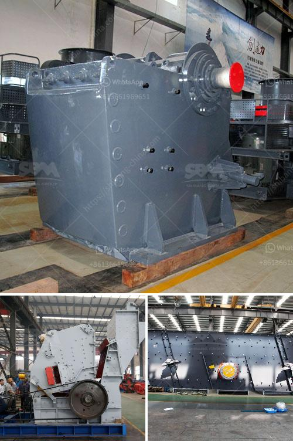

<h3>how to remove the roller of  vertical roller mill</h3>
Vertical roller mills (VRMs) are widely used in the cement industry for grinding raw materials and coal. Despite their efficient operations, unexpected issues can occur, leading to downtime and high maintenance costs. One such issue is the need to remove the roller for maintenance, repairs, or replacement. In this article, we will provide a step-by-step guide on how to remove the roller of a vertical roller mill effectively.

Before starting any maintenance or repair work on a VRM roller, the first and foremost priority is to ensure safety. Make sure power to the mill is turned off, and the area is properly secured to prevent any accidental startup or injury. Wear appropriate personal protective equipment (PPE), including gloves, safety goggles, and steel-toed shoes.

To remove the roller, the pressure between the hydraulic cylinder and the nitrogen accumulator must be released. Start by closing the hydraulic cylinder inlet valve, followed by the outlet valve. Then, open the nitrogen accumulator discharge valve to release the pressure gradually. Once the pressure gauge displays zero pressure, close the accumulator discharge valve.

Before proceeding further, remove the dust collector to gain access to the roller. Follow the manufacturer’s instructions for dismantling the dust collector, ensuring proper labeling and organization of the parts for easier reassembly later.

To safely remove the roller, prepare a suitable lifting device such as a crane or forklift. Ensure the equipment is in good working condition, well-maintained, and has an appropriate weight capacity for handling the roller. Position the lifting device near the mill for easy access.

Locate and loosen the bolts securing the roller to the mill's frame. These bolts are typically positioned around the roller's circumference. Use appropriate tools like wrenches or socket sets to release the bolts gradually. Ensure you follow the tightening sequence specified by the manufacturer to prevent damage to the machinery.

Once the bolts are fully loosened, instruct the crane or forklift operator to lift the roller carefully. Provide clear instructions to maintain a steady, controlled lift to avoid any accidental slips or damages. Ensure the weight is properly balanced and evenly distributed on the lifting device.

Gently lift the roller away from the mill's frame, aligning it with the lifting device, and carefully lower it to a secure location. Take care to avoid tilting or sudden movements that may cause excessive stress on the roller.

Removing the roller from a vertical roller mill is a crucial task that requires proper planning, equipment, and safety precautions. By following this step-by-step guide, maintenance personnel can effectively and safely remove the roller, allowing for necessary repairs or replacements to be carried out efficiently. Remember to consult the manufacturer's guidelines for specific instructions pertaining to your particular mill model to ensure the procedure is conducted correctly.
<h3>Contact us</h3><ul><li><strong>Whatsapp:&nbsp;<a href="https://wa.me/8613661969651">+8613661969651</a></strong></li><li><a href="https://swt.shibang-china.com/?git&amp;zhl&amp;how to remove the roller of  vertical roller mill"><strong>Online Service(chat now)</strong></a></li></ul><h3>Related</h3><ul><li><a href='how to calculate the processing capacity of the mill .md'>how to calculate the processing capacity of the mill ?</a></li><li><a href='How to use the impact crusher ？.md'>How to use the impact crusher ？</a></li><li><a href='How to control the feed size of the ball mill.md'>How to control the feed size of the ball mill?</a></li><li><a href='how to use jaw and impact crusher.md'>how to use jaw and impact crusher</a></li><li><a href='How to increase the output of jaw crusher .md'>How to increase the output of jaw crusher ?</a></li></ul>