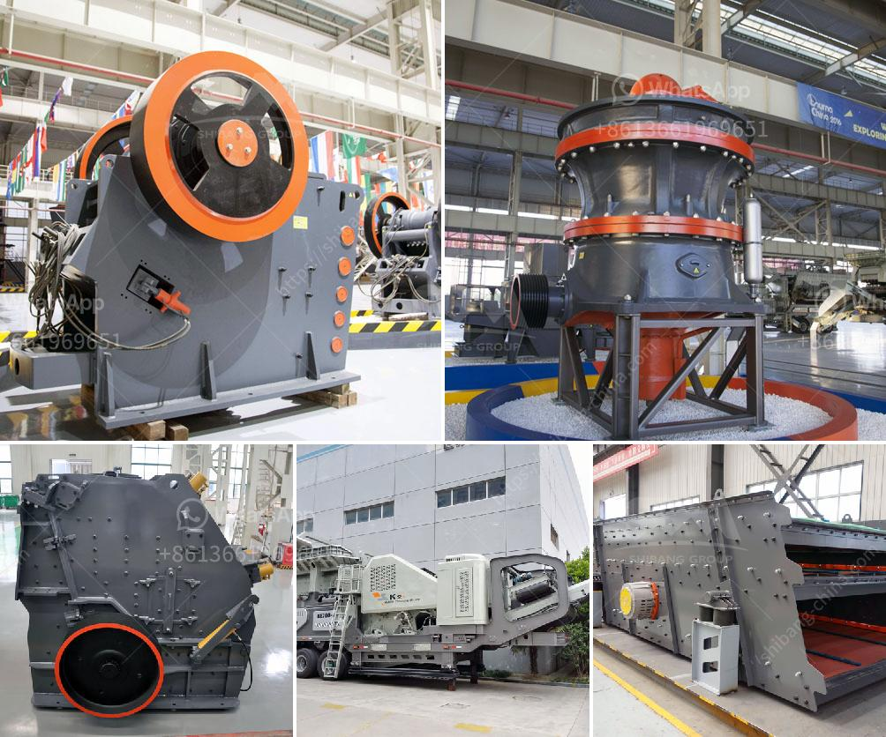

<h3>how to repair a vibrating Sand Washer  ？</h3>
If you own a sand washer and notice it vibrating excessively, it is important to address the issue promptly. A vibrating sand washer can lead to reduced efficiency and washing performance, increased wear and tear on the machine, and even potential damage to surrounding structures. Fortunately, there are several steps you can take to diagnose and repair a vibrating sand washer. This article will guide you through the process with easy-to-follow instructions.

First, it is crucial to identify the possible causes of the vibrations. There are several common reasons behind a vibrating sand washer, including:

1. Imbalance: An uneven distribution of sand or other materials inside the washing drum can lead to vibrations. This imbalance can be caused by overloading or improper loading techniques.

2. Damaged or worn-out parts: Sand washers consist of various components such as the bearings, drive belt, pulleys, and motor. If any of these parts are damaged or worn out, it can result in vibrations.

3. Misalignment: A misaligned assembly or improperly adjusted belt tension can cause the sand washer to vibrate.

1. Check for imbalances: Start by inspecting the load inside the washing drum. Ensure it is evenly distributed. If you notice any clumps or excess material on one side, redistribute it evenly across the drum.

2. Test the levelness: Use a reliable level to check if the machine's base or support structure is level. Adjust it if necessary, as an uneven surface can contribute to vibrations.

3. Examine and replace damaged parts: Carefully inspect all the components of the sand washer for any signs of damage or wear. Pay particular attention to the bearings, drive belt, pulleys, and motor. If you notice any issues, replace the damaged parts with high-quality replacements.

4. Check alignment: Verify that the sand washer assembly is properly aligned. Adjust the assembly or belt tension if needed.

5. Regular maintenance: Prevent future vibration issues by following a regular maintenance schedule. This should include cleaning the washing drum, removing any debris, and lubricating the moving parts.

If the above steps do not resolve the vibrating issue or if you are unsure about performing the repairs yourself, it is advisable to contact a professional technician or the manufacturer's service center. They will have the expertise and necessary tools to diagnose and repair the sand washer effectively.

Remember, taking prompt action to repair a vibrating sand washer is essential for maintaining its longevity and optimal performance. By following the steps mentioned above, you can identify the cause of the vibrations and rectify the issue, ensuring a smooth and efficient washing experience for years to come.
<h3>Contact us</h3><ul><li><strong>Whatsapp:&nbsp;<a href="https://wa.me/8613661969651">+8613661969651</a></strong></li><li><a href="https://swt.shibang-china.com/?git&amp;zhl&amp;how to repair a vibrating Sand Washer  ？"><strong>Online Service(chat now)</strong></a></li></ul><h3>Related</h3><ul><li><a href='How to maintain the stone crusher .md'>How to maintain the stone crusher ?</a></li><li><a href='How to maintenance coal mill.md'>How to maintenance coal mill?</a></li><li><a href='How to choose the jaw crusher motor ？.md'>How to choose the jaw crusher motor ？</a></li><li><a href='how to set up stone grinding machine ？.md'>how to set up stone grinding machine ？</a></li><li><a href='How to manage and run a crushing plant.md'>How to manage and run a crushing plant?</a></li></ul>