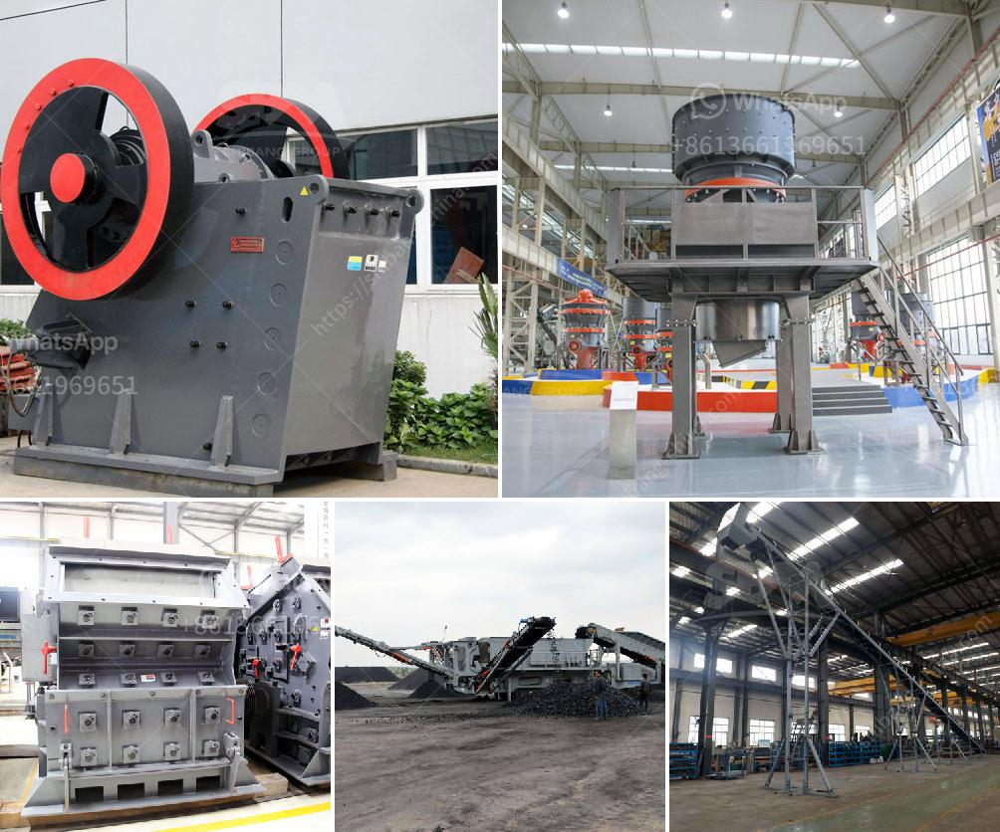

<h3>how to replace dryer bearing ？</h3>
If you're experiencing a loud grinding or squeaking noise coming from your dryer, it could be a sign that the dryer bearing needs to be replaced. The dryer bearing is an essential component that supports the drum and allows it to rotate smoothly. Over time, the bearing may wear out or become damaged, which can lead to a noisy and inefficient dryer. Instead of calling a repair technician, you can save money by replacing the dryer bearing yourself.

1. Safety first: Before starting any repair work, it's important to disconnect the dryer from the power source. Unplug it from the wall outlet or switch off the circuit breaker that supplies power to the dryer.

2. Access the dryer bearing: Depending on the make and model of your dryer, you may need to remove the front or rear panel to access the dryer bearing. Refer to the manufacturer's instructions or consult a user manual to determine the specific steps for your model.

3. Remove the belt: Once you have access to the dryer bearing, you'll need to detach the belt that connects the motor to the drum. Look for the tension pulley or idler pulley that keeps the belt tight. Use a wrench or screwdriver to release the tension and remove the belt from the pulley.

4. Remove the drum: With the belt removed, you can now take out the drum. Carefully lift it out of the dryer, ensuring you have a good grip to prevent dropping and damaging the drum.

5. Replace the dryer bearing: Now that you have the drum removed, you can locate the dryer bearing. It is usually found at the back or front of the drum, typically held in place by screws or brackets. Remove these screws or brackets to detach the old dryer bearing.

6. Install the new dryer bearing: Take the new dryer bearing and align it with the appropriate slots or holes in the dryer. Secure it in place using the screws or brackets that you removed earlier.

7. Reassemble the drum and belt: Carefully reinsert the drum back into the dryer. Make sure it sits properly on the new dryer bearing. Next, loop the belt around the motor pulley and tension pulley, following the diagram on the dryer or refer to the user manual for guidance.

8. Test the dryer: Before closing up the dryer panels, plug the dryer back in and turn it on to test if the noise has been eliminated. If there are still unusual sounds, double-check that the dryer bearing has been properly installed. If the problem persists, there may be additional underlying issues requiring professional assistance.

9. Close up the dryer: Once you're satisfied with the dryer's performance, reattach any panels or covers you removed to access the dryer bearing.

By following these steps and with a little bit of patience, you can replace the dryer bearing on your own, saving yourself the cost of a repair technician. Not only will your dryer operate more quietly, but you'll also be extending the life of your appliance.
<h3>Contact us</h3><ul><li><strong>Whatsapp:&nbsp;<a href="https://wa.me/8613661969651">+8613661969651</a></strong></li><li><a href="https://swt.shibang-china.com/?git&amp;zhl&amp;how to replace dryer bearing ？"><strong>Online Service(chat now)</strong></a></li></ul><h3>Related</h3><ul><li><a href='How to make sand from rocks.md'>How to make sand from rocks?</a></li><li><a href='How to maintain stone crushing plant.md'>How to maintain stone crushing plant?</a></li><li><a href='How to set up a limestone processing plant.md'>How to set up a limestone processing plant?</a></li><li><a href='How to make railway ballast stones.md'>How to make railway ballast stones?</a></li><li><a href='How to fit a jaw crusher flywheel.md'>How to fit a jaw crusher flywheel?</a></li></ul>