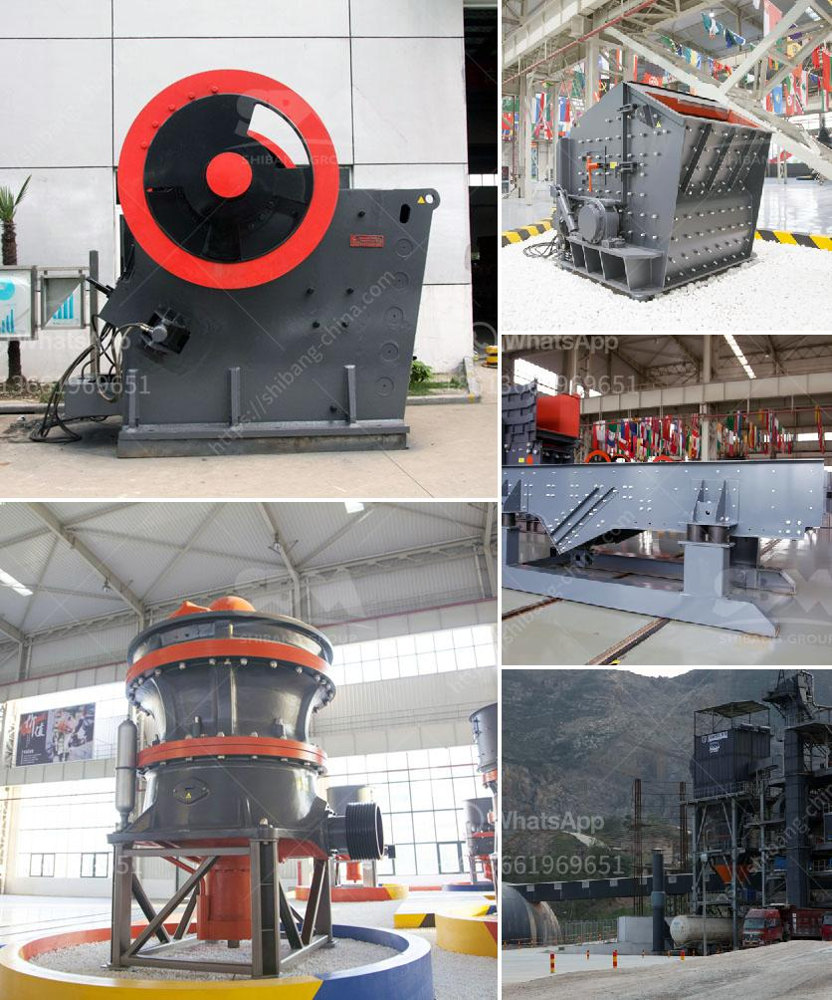

<h3>how to run a quarry business ？</h3>
Running a quarry business is a highly capital-intensive and time-consuming process. It requires heavy equipment, substantial investment, and a lot of planning and organization to operate efficiently. Here are some essential steps to help you establish and run a successful quarry business.

First and foremost, it is crucial to select a suitable location for your quarry. Consider factors such as availability of raw materials, transportation costs, market demand, and proximity to potential customers. Conduct thorough research and evaluate the feasibility of different locations before making a final decision.

Once you have identified the location, you need to obtain the necessary permits and licenses to operate a quarry. This may include securing permissions from local authorities, environmental and safety regulations, and compliance with zoning laws. Engaging legal expertise during this process is recommended to ensure compliance and avoid future complications.

Next, you must invest in the necessary equipment and machinery to extract and process raw materials. This may include excavators, crushers, loaders, dump trucks, drills, and other specialized machinery. Purchase or lease reliable equipment from reputable manufacturers that can withstand the harsh quarry environment and perform efficiently to meet production goals.

Developing a comprehensive business plan is essential for managing and growing your quarry business effectively. Outline your goals, target market, marketing strategies, and financial projections. This plan will serve as a roadmap and help you secure funding, attract investors, and make informed business decisions.

Marketing plays a critical role in attracting customers and generating revenue. Identify your target market and develop strategic marketing initiatives to reach them. This can include digital marketing, advertising in relevant publications, attending trade shows, or building relationships with local construction companies and contractors.

Furthermore, building strong relationships with suppliers is vital to ensure a consistent and reliable supply chain. Collaborate with suppliers who can provide quality raw materials at competitive prices. Strengthening these relationships can help minimize production delays, reduce costs, and maintain profitability.

Managing your quarry efficiently includes optimizing operational processes and ensuring a safe and productive work environment for your employees. Regular maintenance and inspections of equipment are necessary to prevent breakdowns and minimize downtime. Implement effective safety training programs and protocols to protect your workers and comply with industry standards.

It is also important to closely monitor production levels, quality control, and inventory management. Implementing efficient tracking and monitoring systems will help you stay updated on product quantities, adjust production schedules, and maintain optimal inventory levels to meet customer demands.

Lastly, consider implementing sustainable practices in your quarry to minimize environmental impact. This can involve recycling and reusing materials, implementing water management strategies, and preventing soil erosion. Adopting sustainable practices not only benefits the environment but can also enhance your business reputation and attract environmentally conscious customers.

Running a successful quarry business requires careful planning, effective execution, and continuous adaptability to market demands. By following these essential steps, you can lay a solid foundation for a thriving quarry business. Remember, investing in quality equipment, building strong relationships, and maintaining a focus on safety and sustainability are keys to long-term success.
<h3>Contact us</h3><ul><li><strong>Whatsapp:&nbsp;<a href="https://wa.me/8613661969651">+8613661969651</a></strong></li><li><a href="https://swt.shibang-china.com/?git&amp;zhl&amp;how to run a quarry business ？"><strong>Online Service(chat now)</strong></a></li></ul><h3>Related</h3><ul><li><a href='How to beneficiate pyrolusite manganese ore.md'>How to beneficiate pyrolusite manganese ore?</a></li><li><a href='how to choose a crushing machine .md'>how to choose a crushing machine ?</a></li><li><a href='How to Splice Crusher Belt Conveyor ？.md'>How to Splice Crusher Belt Conveyor ？</a></li><li><a href='How does a stone crushing plant work.md'>How does a stone crushing plant work?</a></li><li><a href='how vibrating screen works .md'>how vibrating screen works ?</a></li></ul>