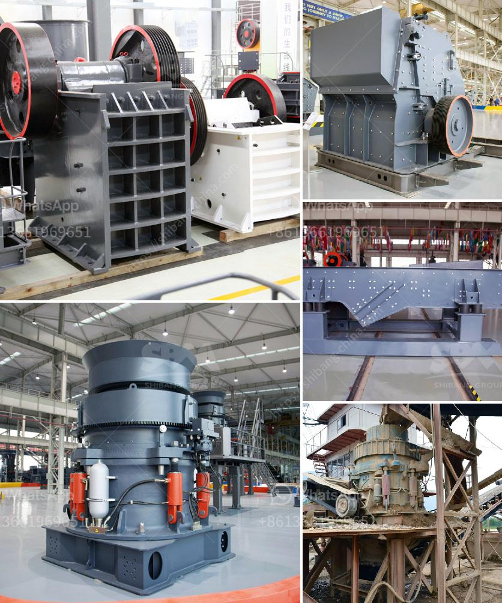

<h3>how to run an impact jaw crusher?</h3>
An impact jaw crusher is a versatile and efficient machine that is commonly used in aggregate production, mining, and recycling applications. It is designed to crush both soft and hard materials, ensuring optimal results and minimizing downtime. If you have recently acquired an impact jaw crusher or are considering investing in one, there are several key steps to follow to ensure its proper operation and maximize its performance.

The first step in running an impact jaw crusher is to familiarize yourself with the machine's components and operation. Understand the layout and functions of each part, such as the feed hopper, vibrating feeder, jaw crusher, impact crusher, and discharge conveyor. Review the manufacturer's manual for specific instructions and guidelines.

Before starting the crusher, make sure the material you intend to crush is suitable for the machine. Remove any oversized or potentially damaging materials from the feed hopper and ensure a consistent supply of properly sized material. Proper material preparation will prevent unnecessary wear on the crusher components and optimize productivity.

To start the impact jaw crusher, follow a specific start-up sequence to ensure a safe and efficient operation. Begin by turning on the power supply and allowing the machine's lubrication system to prime. Then, start the vibrating feeder and adjust the feed rate to match the crusher's capacity. Finally, start the crusher and monitor its performance.

To achieve the desired product size and shape, it is important to adjust the crusher settings according to the material being processed. Depending on the specific model and manufacturer, the impact jaw crusher may offer various adjustable settings, such as the distance between the impact plates or the speed of the rotor. Consult the manufacturer's manual for guidance on the recommended crusher settings for different applications.

A well-maintained impact jaw crusher will deliver the best results and have a longer lifespan. Establish a routine maintenance schedule and perform regular inspections of the machine. Check and replace worn-out or damaged parts, such as impact plates, blow bars, or bearings, to ensure optimal performance. Keep the crusher clean from debris and perform regular lubrication tasks to prevent unnecessary wear and tear.

Properly trained operators play a crucial role in running an impact jaw crusher efficiently and safely. Provide comprehensive training to all personnel involved in the crusher's operation, emphasizing the importance of safety procedures, maintenance tasks, and proper material handling. Ensure that operators understand how to monitor and adjust the crusher settings for different applications.

In summary, running an impact jaw crusher requires careful preparation, regular maintenance, and knowledgeable operators. By familiarizing yourself with the equipment, properly preparing the material, following the correct start-up sequence, adjusting the crusher settings, and implementing a routine maintenance schedule, you can ensure the crusher's optimal performance and extend its lifespan. Remember that safety is paramount, and always consult the manufacturer's manual for specific instructions and guidelines.
<h3>Contact us</h3><ul><li><strong>Whatsapp:&nbsp;<a href="https://wa.me/8613661969651">+8613661969651</a></strong></li><li><a href="https://swt.shibang-china.com/?git&amp;zhl&amp;how to run an impact jaw crusher"><strong>Online Service(chat now)</strong></a></li></ul><h3>Related</h3><ul><li><a href='How much area is required for the installation of a crusher plant.md'>How much area is required for the installation of a crusher plant?</a></li><li><a href='how to improve the jaw crusher working efficiency？.md'>how to improve the jaw crusher working efficiency？</a></li><li><a href='How to set up stone crushing business in kenya .md'>How to set up stone crushing business in kenya ?</a></li><li><a href='How to ensure the efficient operation of impact crusher.md'>How to ensure the efficient operation of impact crusher?</a></li><li><a href='7 Factors Affecting the Price of Jaw Crusher.md'>7 Factors Affecting the Price of Jaw Crusher</a></li></ul>