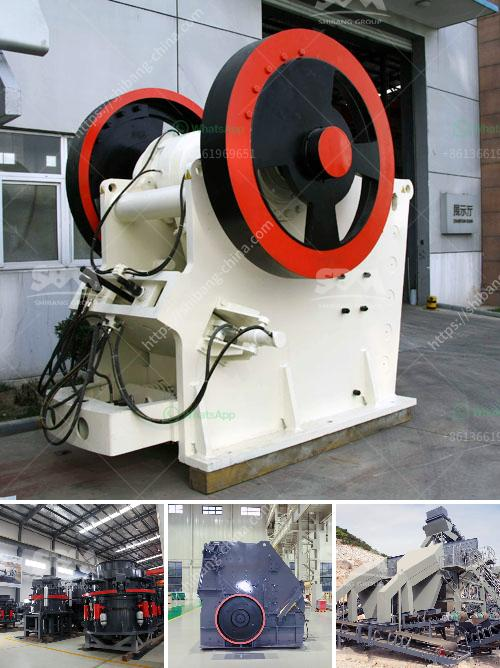

<h3>how to separate iron from basalt？</h3>
Basalt is a common volcanic rock formed from the rapid cooling of lava. It consists mainly of minerals such as pyroxene, plagioclase feldspar, and olivine. While it is rich in iron, separating this iron from basalt can be a challenging process. However, with the right techniques and equipment, it is possible to extract iron from basalt effectively. In this article, we will explore some methods used for separating iron from basalt.

Magnetic separation is a common method used for separating metallic iron from non-metallic materials. In the case of basalt, iron is usually found in the form of magnetite or hematite, which are magnetic minerals. By applying a magnetic field, these minerals can be attracted to a magnet, allowing for their separation from the basalt. Magnetic separation can be done using either wet or dry processes, depending on the specific requirements of the iron ore.

Before the separation process can begin, it is important to crush and grind the basalt into small particles. This increases the surface area of the basalt, making it easier to separate the iron minerals. Crushing can be done using mechanical crushers or even explosives, while grinding is typically achieved using grinding mills.

Froth flotation is commonly used for the separation of non-ferrous metal minerals, but it can also be employed for separating iron from basalt. In this process, a mixture of finely ground basalt and water is combined with flotation agents. Air is then blown through the mixture, creating bubbles that attach to the iron minerals. These bubbles rise to the surface and form a froth layer, which can be skimmed off to separate the iron minerals from the basalt.

For finer grain sizes of basalt, high-intensity magnetic separation can be used. This technique involves passing a high-intensity magnetic field through a slurry of basalt particles. The magnetic field causes the iron minerals to be attracted to the magnetic poles, allowing for their separation. High-intensity magnetic separation is often combined with other methods, such as froth flotation, to enhance the efficiency of the separation process.

In some cases, it may be necessary to further process the separated iron minerals to obtain pure iron. This can be achieved through smelting, where the iron minerals are heated in a furnace to extract the iron. The extracted iron can then undergo refining processes, such as purification and alloying, to improve its quality and usability.

In conclusion, while separating iron from basalt can be a challenging task, various methods can be used to achieve this separation effectively. These methods include magnetic separation, crushing and grinding, froth flotation, high-intensity magnetic separation, and smelting and refining. The choice of method depends on factors such as the size of the basalt particles, the mineral composition, and the desired purity of the extracted iron. With the right techniques and equipment, it is possible to separate iron from basalt efficiently.
<h3>Contact us</h3><ul><li><strong>Whatsapp:&nbsp;<a href="https://wa.me/8613661969651">+8613661969651</a></strong></li><li><a href="https://swt.shibang-china.com/?git&amp;zhl&amp;how to separate iron from basalt？"><strong>Online Service(chat now)</strong></a></li></ul><h3>Related</h3><ul><li><a href='How does a spring cone crusher work.md'>How does a spring cone crusher work?</a></li><li><a href='How to design a ball mill for cement ？.md'>How to design a ball mill for cement ？</a></li><li><a href='How to process lightweight aggregates in Ethiopia.md'>How to process lightweight aggregates in Ethiopia?</a></li><li><a href='How to choose jaw crusher in Malaysia 7 suggestions for you.md'>How to choose jaw crusher in Malaysia? 7 suggestions for you</a></li><li><a href='How to operate a vibrating screen.md'>How to operate a vibrating screen?</a></li></ul>