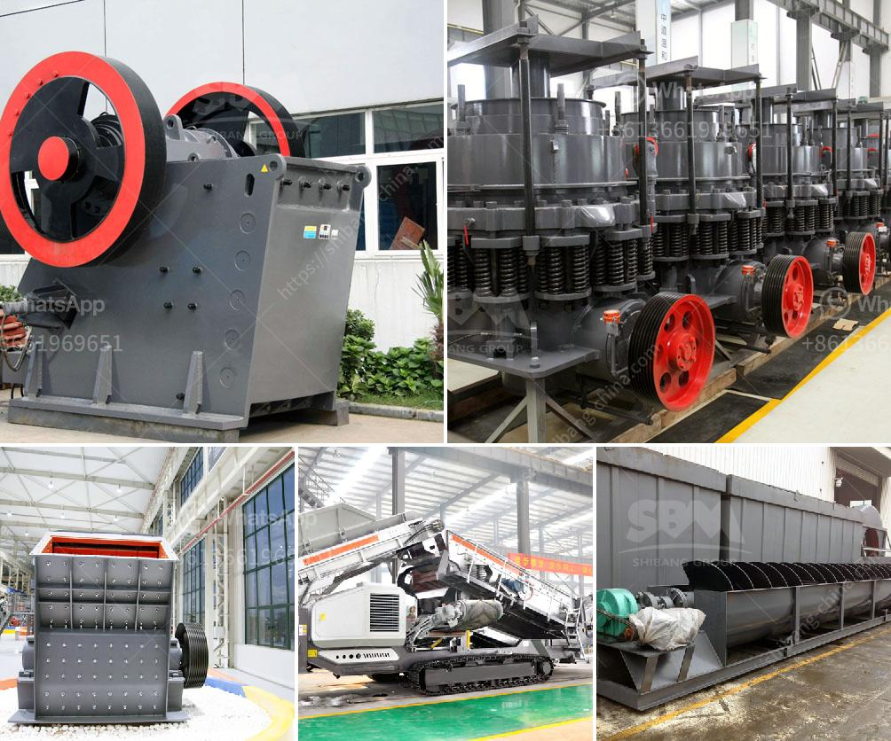

<h3>how to set up stone crusher unit ？</h3>
Stone crushing industry is an important industrial sector in the country. It is advantageous if the crushed stone unit is set up near the quarries where the granite boulders of various sizes are available for the crushing unit. The wastage from the granite industry will be of much use to the crushed stone unit. Stone crushing plant can be established with different types of installations such as jaw crusher, impact crusher, cone crusher, and screening plant.

Stone crushing plant mainly includes vibrating feeder, jaw crusher, cone crusher, impact crusher, vertical shaft impact crusher, vibrating screen, belt conveyor, electric control panel, etc. It could crush and screen various materials such as limestone, marble, granite, basalt, river stone, etc to produce sand and gravels for construction with multiple granularity specifications.

1. Preparing Land: Land acquisition is important because, to set up the plant, the raw materials like stones, sand, and gravel should be available nearby.

2. Environmental Permissions: Different plant setup companies have different environmental permissions. It is a must to check the required permissions with local authorities before starting the operation.

3. Procuring Raw Materials: Depending on the type of stone crusher, the raw material may be fed into the hopper either by a loader or directly. It is important to separate different sizes of aggregates from different raw materials.

4. Primary Crushing: The large stone is uniformly fed into the jaw crusher by the vibrating feeder for rough crushing, which can crush the stone into 80-150mm and then transferred to the impact crusher or cone crusher for further crushing.

5. Secondary Crushing: When the primary crushing process is complete, the secondary crushing process starts. The jaw crusher and cone crusher crushes large-sized stones into smaller particles to produce sand and aggregate particles, which are usually used as a raw material for construction.

6. Screening: The crushed material is sent to the vibrating screen to separate the desired particle size from the oversize stone material. The oversize material is sent back to the crusher for further crushing.

7. Washing and Stockpiling: The crushed stone material may require washing to minimize the presence of impurities and to ensure the consistency of the gradation. The washed material is then stockpiled in a designated area.

8. Power Supply: The stone crushing unit will require an electricity supply. For this purpose, a transformer, generator, or connection to the grid may be necessary.

9. Pollution Control: Proper pollution control measures should be taken to minimize dust and noise pollution during the operation of the stone crushing unit. This may include dust control systems, water sprayers, and enclosing the crushing unit.

10. Maintenance and Repairs: Regular maintenance and periodic repairs of the equipment and machinery are essential to ensure the smooth operation of the stone crushing unit.

In conclusion, setting up a stone crusher unit is beneficial for numerous reasons. It not only increases employment opportunities but also helps in providing a stable supply of vital resources, such as crushed stone, sand, and gravel, required for construction projects. Following the mentioned steps and complying with the necessary regulations and permits will ensure a successful setup of a stone crushing unit.
<h3>Contact us</h3><ul><li><strong>Whatsapp:&nbsp;<a href="https://wa.me/8613661969651">+8613661969651</a></strong></li><li><a href="https://swt.shibang-china.com/?git&amp;zhl&amp;how to set up stone crusher unit ？"><strong>Online Service(chat now)</strong></a></li></ul><h3>Related</h3><ul><li><a href='How to remove the gasket on the mineral ball mill.md'>How to remove the gasket on the mineral ball mill?</a></li><li><a href='How to Buy a Stone Crusher in India ？.md'>How to Buy a Stone Crusher in India ？</a></li><li><a href='How to Calculate the Amount of Dust generated by a stone crusher.md'>How to Calculate the Amount of Dust generated by a stone crusher</a></li><li><a href='how to install and operate hammer crusher.md'>how to install and operate hammer crusher?</a></li><li><a href='how to run an impact jaw crusher.md'>how to run an impact jaw crusher?</a></li></ul>