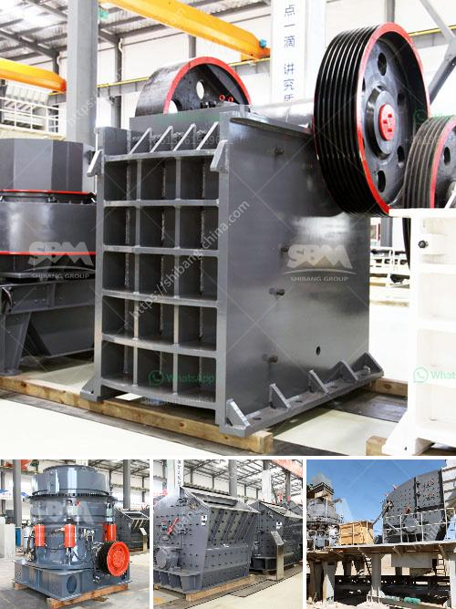

<h3>how to set up stone grinding machine ？</h3>
Setting up a stone grinding machine can be quite a task, but with the right tools and equipment, it is achievable. Here's a step-by-step guide on how to set up your stone grinding machine:

1. Identify the Location: Before even beginning the setup process, it is crucial to find the perfect location for your stone grinding machine. Ensure there is enough space for the machine, a workbench, and other necessary tools and materials. Additionally, the area should be well-ventilated and protected from excessive moisture.

2. Gather the Tools and Equipment: To set up a stone grinding machine, you'll need various tools and equipment. Here are the essentials:

- Stone grinding machine: Choose a suitable machine that fits your needs and requirements. It should have a powerful motor, a stable base, and adjustable settings.

- Protective gear: Safety should always be a priority. Wear safety goggles, gloves, and a dust mask to protect yourself from debris and dust particles.

- Grinding stones: Depending on the type of stones you'll be working with, choose appropriate grinding stones. These stones come in various grit sizes, allowing you to achieve different levels of coarseness.

- Water source: Grinding stones require constant lubrication to prevent overheating and to wash away debris. Ensure you have a water source nearby, such as a portable water tank or a hose connected to a faucet.

3. Prepare the Workbench: Next, prepare a sturdy workbench or table. It should be strong enough to support the weight of the machine and stable during operation. Place a rubber mat or a non-slip surface on the workbench to prevent the machine from sliding or vibrating.

4. Position the Grinding Machine: Position the stone grinding machine on the workbench, ensuring it is at a comfortable height that allows you to keep a proper posture while operating. Secure the machine by tightening any screws or bolts, if required.

5. Connect the Power Supply: Depending on the type of machine, connect it to a power supply. Ensure that the voltage matches the machine's requirement to avoid damaging the motor or causing a short circuit.

6. Mount the Grinding Stones: Depending on the machine's design, mount the grinding stones. Read the manufacturer's instructions carefully to ensure proper installation. Pay attention to the direction of rotation indicated by arrows on the stones – they should always rotate towards you to avoid accidents.

7. Adjust the Grinding Settings: Some machines offer adjustable grinding settings, allowing you to change the depth or coarseness of the grind. Adjust these settings according to your needs, and refer to the machine's manual for guidance.

8. Test and Fine-tune: Before starting any significant grinding work, test the machine to ensure it is functioning correctly. Fine-tune any adjustments if necessary, such as tightening or loosening the grinding stones or adjusting the water flow for optimum performance.

9. Practice Safety Precautions: Lastly, always ensure that you follow safety precautions while operating the stone grinding machine. Avoid wearing loose clothing, secure long hair, and keep fingers and hands away from the rotating parts. Additionally, work in a well-ventilated area or wear a dust mask to prevent inhaling stone dust.

In conclusion, setting up a stone grinding machine requires careful planning and proper execution. By following these steps and practicing safety precautions, you can successfully set up your machine and start grinding stones efficiently. Remember to check the machine's manual for any specific instructions or recommendations from the manufacturer. Happy grinding!
<h3>Contact us</h3><ul><li><strong>Whatsapp:&nbsp;<a href="https://wa.me/8613661969651">+8613661969651</a></strong></li><li><a href="https://swt.shibang-china.com/?git&amp;zhl&amp;how to set up stone grinding machine ？"><strong>Online Service(chat now)</strong></a></li></ul><h3>Related</h3><ul><li><a href='How is the cone crusher working.md'>How is the cone crusher working?</a></li><li><a href='How to grind bentonite clay .md'>How to grind bentonite clay ?</a></li><li><a href='How to choose the suitable jaw crusher model.md'>How to choose the suitable jaw crusher model?</a></li><li><a href='How to grind fly ash with a ball mill made in China ？.md'>How to grind fly ash with a ball mill made in China ？</a></li><li><a href='How to repair a damaged ball mill shaft.md'>How to repair a damaged ball mill shaft?</a></li></ul>