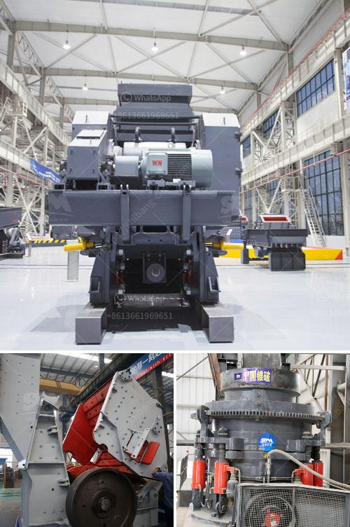

<h3>how to setup up a stone crusher plant in malaysia ？</h3>
Setting up a stone crusher plant is a straightforward process that involves a lot of planning and coordination. Here is an overview of the steps involved in setting up a stone crusher plant in Malaysia.

Firstly, you need to identify the site for the stone crusher plant. It is important to consider the following factors when choosing the location:

- The site should be close to the source of raw materials, such as quarries or mines, to minimize transportation costs.

- Local regulations and permits should be considered to ensure compliance with environmental standards.

Before setting up the plant, you need to obtain all the necessary permits and licenses from the relevant authorities. This may include environmental clearances, operating licenses, and other regulatory approvals. Consult with local authorities and agencies to understand the specific requirements in your area.

Next, you need to plan the layout of the stone crusher plant. This involves determining the optimum placement of equipment, machinery, and infrastructure. Consider factors such as ease of access, traffic flow, and safety precautions when planning the layout. You may need the help of an expert or consultant to design an efficient layout.

Once the layout is finalized, you can start procuring the equipment and machinery required for the stone crusher plant. This may include crushers, conveyors, feeders, and screens. Work with reputable suppliers and manufacturers to ensure the quality and reliability of the equipment.

After you have obtained the necessary equipment, it is time to install and setup the stone crusher plant. Follow the manufacturer's instructions and guidelines for proper installation. Ensure that all connections, electrical wirings, and safety measures are in place. Conduct thorough testing to verify the functionality and performance of the plant before commissioning.

Maintenance is crucial for the smooth operation of the stone crusher plant. Establish a regular maintenance schedule and conduct inspections to identify and address any issues or faults. Train your employees on how to operate the plant safely and effectively. Provide proper training on maintenance procedures, troubleshooting, and emergency protocols.

Once the stone crusher plant is operational, continuously monitor its performance to identify opportunities for optimization. Keep track of key metrics such as production output, equipment efficiency, and energy consumption. Implement necessary changes and improvements to maximize productivity and minimize costs.

In conclusion, setting up a stone crusher plant in Malaysia involves careful planning and execution. Consider various factors such as location, permits, layout, equipment procurement, installation, and maintenance. A well-designed and efficiently-operated stone crusher plant can significantly contribute to the overall profitability and success of your business.
<h3>Contact us</h3><ul><li><strong>Whatsapp:&nbsp;<a href="https://wa.me/8613661969651">+8613661969651</a></strong></li><li><a href="https://swt.shibang-china.com/?git&amp;zhl&amp;how to setup up a stone crusher plant in malaysia ？"><strong>Online Service(chat now)</strong></a></li></ul><h3>Related</h3><ul><li><a href='How to design an iron ore conveyor.md'>How to design an iron ore conveyor?</a></li><li><a href='How to set up a small gold crushing plant 7 steps to help you.md'>How to set up a small gold crushing plant? 7 steps to help you</a></li><li><a href='How can I improve the grinding of a raw mill.md'>How can I improve the grinding of a raw mill?</a></li><li><a href='How to install a conveyor belt down a crusher.md'>How to install a conveyor belt down a crusher?</a></li><li><a href='How to increase the capacity of ball mill .md'>How to increase the capacity of ball mill ?</a></li></ul>