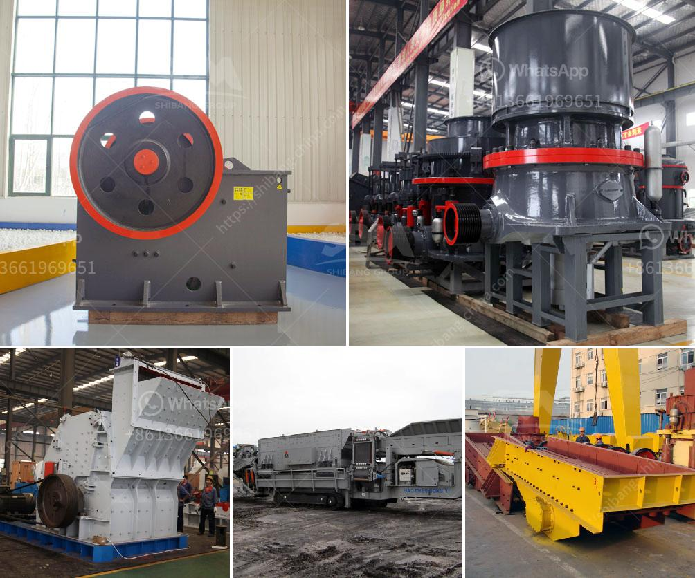

<h3>how to size a limestone screen？</h3>
Choosing the right sized limestone screen is crucial in many construction and landscaping projects. Properly sized screens ensure that the limestone material meets the desired specifications and is optimally utilized for the intended application. Whether you are working on a residential project or a large-scale commercial venture, understanding how to size a limestone screen is essential for achieving the desired results.

The first step in sizing a limestone screen is to determine the specific requirements of your project. Consider factors such as the application, the required particle size distribution, and the desired quality of the final product. For example, if you are using limestone as a base material for road construction, you may require a different screen size compared to using limestone for decorative purposes in a garden.

Once you have identified your project requirements, it is important to understand the terminology used in screen sizing. Mesh size is often used to define the size of screen openings. It refers to the number of openings per linear inch or the number of wires per linear inch. The higher the mesh size number, the smaller the screen openings and the finer the material it will allow to pass through.

To determine the mesh size required for your limestone screen, it is crucial to understand the intended purpose of the material. If you need larger, coarser limestone particles, opt for a lower mesh size screen. Conversely, if you need finer particles for specific applications, a higher mesh size screen will be necessary. Consider consulting with an expert or taking guidance from professionals in the field to ensure accurate sizing based on your specific project requirements.

Another important factor to consider when sizing a limestone screen is the throughput or capacity of the screening machine. The machine’s capacity determines the amount of material that can pass through the screen in a given time. It is essential to choose a screen size that matches the capacity of your screening equipment, ensuring efficient and effective processing of the limestone material.

Additionally, the shape and size of the limestone particles themselves can impact screen sizing. Angular or irregularly shaped particles may require larger openings to allow them to pass through the screen, whereas more uniformly shaped particles can be screened with smaller mesh sizes.

Furthermore, it is worth noting that different regions may have varying regulations and standards for screen sizing based on specific project requirements. Familiarize yourself with local guidelines to ensure compliance and avoid any potential issues during the screening process.

In conclusion, sizing a limestone screen is a crucial step in any construction or landscaping project involving limestone materials. Consider the specific requirements of your project, understand the terminology and mesh sizing, and ensure the capacity of your screening equipment matches the chosen screen size. By adhering to these guidelines, you can confidently select and size a limestone screen that meets your project's specifications, ensuring optimal performance and desired results.
<h3>Contact us</h3><ul><li><strong>Whatsapp:&nbsp;<a href="https://wa.me/8613661969651">+8613661969651</a></strong></li><li><a href="https://swt.shibang-china.com/?git&amp;zhl&amp;how to size a limestone screen？"><strong>Online Service(chat now)</strong></a></li></ul><h3>Related</h3><ul><li><a href='How to turn off crushing and screening plant.md'>How to turn off crushing and screening plant?</a></li><li><a href='How much does calcite mineral processing equipment cost.md'>How much does calcite mineral processing equipment cost?</a></li><li><a href='how to crush ore to 100 mesh grinding mill china？.md'>how to crush ore to 100 mesh grinding mill china？</a></li><li><a href='How to buy a stone crusher machine in Africa.md'>How to buy a stone crusher machine in Africa</a></li><li><a href='How to weld the broken jaw plate of jaw crusher.md'>How to weld the broken jaw plate of jaw crusher?</a></li></ul>