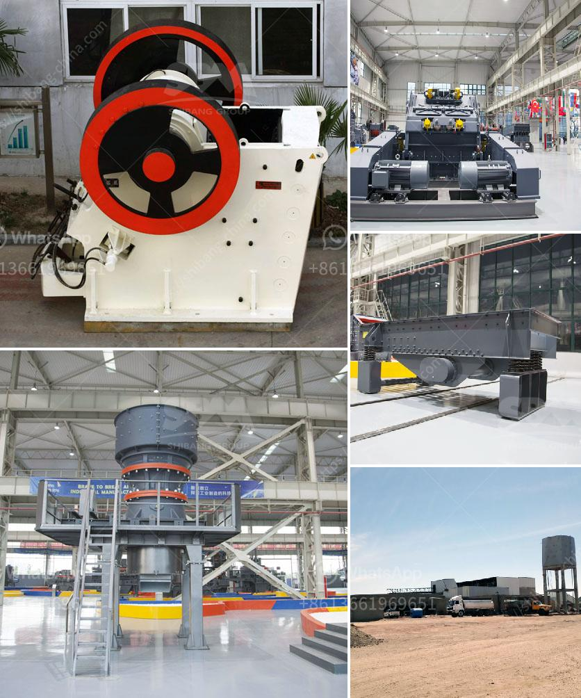

<h3>how to start a mini cement mill ？</h3>
Starting a mini cement mill is not easy, but it can be achievable if you are committed to the endeavor and willing to put in the required time and effort. Here are a few steps to help you get started:

1. Obtain the necessary licenses and permits: In order to set up your mini cement mill, you need to obtain various government licenses and permits. Ensure to discuss the requirements with a lawyer or consultant to guide you through the process, as it varies from one location to another.

2. Identify the location: You need to find a suitable location for your mini cement mill. Ideally, it should be close to the source of raw materials such as limestone and clay. The location should also have good transportation links to ensure efficient shipping of the finished product.

3. Procure the necessary equipment: The main equipment required for the mini cement mill are cement kiln, cement mill, cement silo, and related machinery. The cost of equipment is dependent on the capacity of the mill and the type of production facility you want to establish. Therefore, you need to decide on the scale of your mini cement mill before purchasing the equipment.

4. Arrange financial resources: Setting up a mini cement mill requires considerable capital investment. You can finance the project through your savings or by obtaining a loan from a financial institution. Remember to prepare a detailed business plan and financial projections to convince lenders or investors.

5. Hire skilled workers: Operating a cement mill requires specialized skills. Look for experienced and skilled workers who have knowledge of the cement industry. They will be responsible for the smooth operation and maintenance of the machinery.

6. Source raw materials: As mentioned earlier, the primary raw materials for cement production are limestone and clay. Identify local suppliers who can provide these raw materials at a reasonable price. Establishing strong relationships with suppliers is essential to ensure a consistent supply of quality raw materials.

7. Develop a marketing strategy: Creating a marketing strategy is crucial to establish a customer base and sell your cement products. Identify potential buyers such as construction companies, contractors, and retailers. Attend trade shows, exhibitions, and industry conferences to network with potential customers and showcase your products.

8. Ensure adherence to safety regulations: Safety should be a top priority when operating a mini cement mill. Familiarize yourself and your employees with the safety regulations and guidelines set by the regulatory authorities. Install safety equipment and provide appropriate training to ensure the well-being of your workers.

In conclusion, starting a mini cement mill requires careful planning and execution. Ensure you have the necessary licenses, obtain a suitable location, procure the required equipment, secure financial resources, hire skilled workers, source raw materials, develop a marketing strategy, and prioritize safety. By following these steps, you can lay the foundation for a successful mini cement mill.
<h3>Contact us</h3><ul><li><strong>Whatsapp:&nbsp;<a href="https://wa.me/8613661969651">+8613661969651</a></strong></li><li><a href="https://swt.shibang-china.com/?git&amp;zhl&amp;how to start a mini cement mill ？"><strong>Online Service(chat now)</strong></a></li></ul><h3>Related</h3><ul><li><a href='How to design an impact crusher.md'>How to design an impact crusher?</a></li><li><a href='How to install ore jaw crusher.md'>How to install ore jaw crusher?</a></li><li><a href='How to choose a stone grinding machine ？.md'>How to choose a stone grinding machine ？</a></li><li><a href='How to Build a Granite Jaw Crusher in South Africa ？.md'>How to Build a Granite Jaw Crusher in South Africa ？</a></li><li><a href='How to choose a vibration motor.md'>How to choose a vibration motor?</a></li></ul>