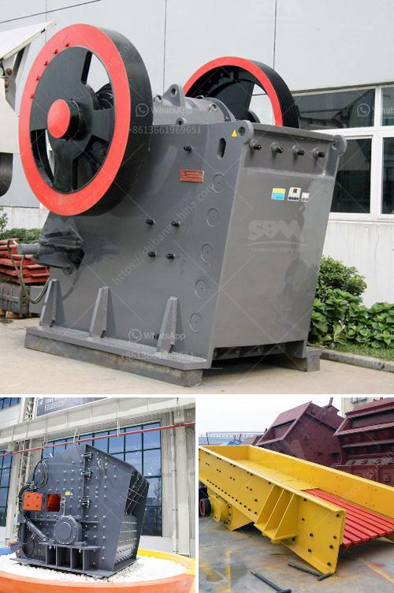

<h3>how to start a stone crushing business in USA ?</h3>
Starting a stone crushing business can be a lucrative venture for aspiring entrepreneurs. This is especially true if you have the knowledge and expertise in this particular industry. As the construction industry continues to thrive, you can capitalize on the growing demand for crushed stones for various applications such as road construction, building construction, and landscaping.

1. Obtain the necessary licenses and permits: Before you commence operations, ensure that you have the required licenses and permits from the relevant authorities. Contact your local government offices or visit their websites to learn about the specific permits you need to operate a stone crushing business in your area.

2. Select a suitable location: The success of your stone crushing business largely depends on your location. Choose a site where there is a high demand for crushed stones and proximity to construction sites. Also, consider factors such as transportation options and the availability of raw materials in your area.

3. Conduct market research: Before you start your stone crushing business, conduct thorough market research to understand the current market trends and demand for crushed stones. Identify potential customers, competitors, and key industry players. This will help you assess the viability of your business and develop a comprehensive business plan.

4. Develop a business plan: A well-written business plan is crucial for the success of any business, including a stone crushing business. Outline your business concept, mission, vision, target market, and competition. Include financial projections, marketing strategies, and an operational plan. A robust business plan will not only guide you through the start-up phase but also facilitate future growth and secure potential funding.

5. Secure funding: Starting a stone crushing business requires adequate capital to purchase equipment, lease land, and cover operating expenses. Consider approaching financial institutions, investors, or applying for small business loans to secure the necessary funding.

6. Acquire equipment: Stone crushing equipment is essential for your business operations. Depending on the scale of your operation, you may need crushers, excavators, loaders, and trucks. It is advisable to purchase the equipment from reputable suppliers to ensure its quality and reliability. Additionally, consider hiring skilled technicians or operators to handle the machinery.

7. Develop a marketing strategy: To attract customers and generate sales, you need to develop an effective marketing strategy. Create a website for your business, improve your online presence, and utilize various digital marketing tools to reach your target audience. Also, establish relationships with local contractors and construction companies, attend trade shows and conferences, and offer competitive pricing.

8. Ensure legal compliance and safety: Comply with all local, state, and federal regulations related to your stone crushing business. Besides obtaining permits, implement safety protocols to protect your employees and ensure compliance with health and safety standards. Consider conducting regular inspections and maintenance of equipment to prevent accidents and ensure smooth operations.

Starting a stone crushing business requires meticulous planning, market analysis, and strategic implementation. By following these steps, you can set a solid foundation for your business, increase your chances of success, and contribute to the growth of the construction industry in the USA.
<h3>Contact us</h3><ul><li><strong>Whatsapp:&nbsp;<a href="https://wa.me/8613661969651">+8613661969651</a></strong></li><li><a href="https://swt.shibang-china.com/?git&amp;zhl&amp;how to start a stone crushing business in USA "><strong>Online Service(chat now)</strong></a></li></ul><h3>Related</h3><ul><li><a href='How to reduce VSI crusher noise.md'>How to reduce VSI crusher noise?</a></li><li><a href='How to make sand from quartzite customer case .md'>How to make sand from quartzite customer case ?</a></li><li><a href='how is iron ore transported to kenya.md'>how is iron ore transported to kenya</a></li><li><a href='How to adjust a singletoggle jaw crusher.md'>How to adjust a single-toggle jaw crusher?</a></li><li><a href='How to design a ball mill for cement ？.md'>How to design a ball mill for cement ？</a></li></ul>