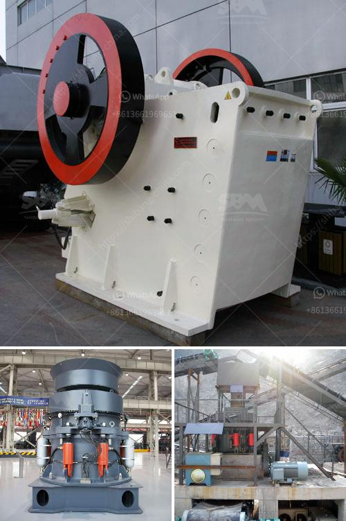

<h3>how to use jaw and impact crusher</h3>
Crushing equipment plays an essential role in the aggregate and mining industries. It is used to break large rocks into smaller pieces for further processing. The two most common types of crushers are jaw and impact crushers. In this article, we will explore how to use jaw and impact crushers appropriately for efficient crushing.

A jaw crusher is a compression type crusher, comprised of a fixed jaw and moving jaw positioned in a V-shaped alignment. The movable jaw compresses material against the fixed jaw, crushing it to the desired size. The material exits the jaw crusher through the bottom of the crusher otherwise known as the discharge opening.

Often, jaw crushers are used as primary crushers because they can take large and variable sized feed material. Jaw crushers are designed to crush efficiently and quickly, which is why they are often referred to as primary crushers. Jaw crushers are one of the most popular equipment types in the mining industry and they are known as a reliable and robust machine.

1. Remove any materials that do not meet the specifications of the desired output material. This step may involve removing larger blocks of rocks and boulders.

3. Inspect the wear parts, such as jaw plates, toggle plate, toggle seat, flywheel, and counterbalance weight, regularly, and replace them if necessary.

5. Track the material onto the feeder, and ensure a consistent and regulated flow into the crushing chamber.

An impact crusher, on the other hand, utilizes a rotating beaters or hammers in order to break material. The feed enters the machine’s crushing chamber where it is struck by rapidly rotating hammers. The hammers repeatedly strike the material until it shatters into smaller pieces, passing through the openings in the screen.

To effectively use an impact crusher in the crushing process, it is important to understand its configuration and operation:

4. The material is picked up by the rapidly rotating hammers and impact against the breaker plates. The energy from impact is absorbed, reducing the size of the material.

In conclusion, jaw and impact crushers are key equipment types for mining and aggregate industries. When used correctly, they deliver efficient and consistent crushing performance. Understanding how to deploy and use these machines effectively will ensure successful operations and maximum productivity.
<h3>Contact us</h3><ul><li><strong>Whatsapp:&nbsp;<a href="https://wa.me/8613661969651">+8613661969651</a></strong></li><li><a href="https://swt.shibang-china.com/?git&amp;zhl&amp;how to use jaw and impact crusher"><strong>Online Service(chat now)</strong></a></li></ul><h3>Related</h3><ul><li><a href='How to Build a Marble Mill ？.md'>How to Build a Marble Mill ？</a></li><li><a href='How to select a site for aggregate quarry in kenya .md'>How to select a site for aggregate quarry in kenya ?</a></li><li><a href='How to select ball mill.md'>How to select ball mill?</a></li><li><a href='How does a tungsten ore crusher work.md'>How does a tungsten ore crusher work?</a></li><li><a href='How much area is required for the installation of a crusher plant.md'>How much area is required for the installation of a crusher plant?</a></li></ul>