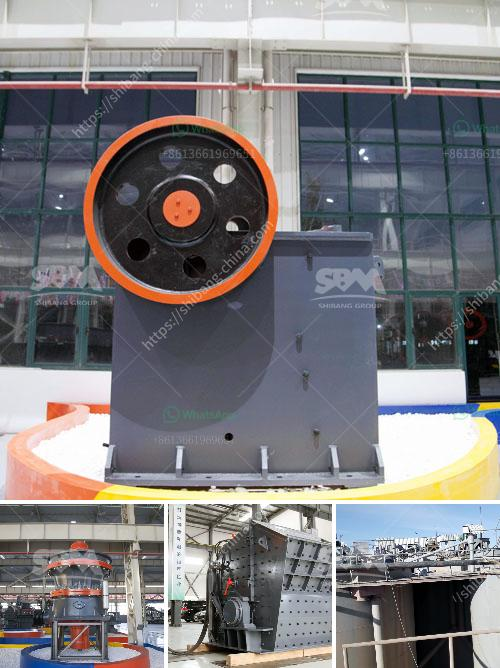

<h3>how to work cone crusher ？</h3>
Cone crushers are used in various industries, including mining and construction, for crushing different materials like rocks and ores. However, as with any machine, there are certain guidelines to follow to ensure proper operation and maximize its performance. In this article, we will provide a comprehensive guide on how to work a cone crusher effectively.

Before diving into the detailed working process, it is essential to have a basic understanding of cone crushers. These machines consist of a crushing chamber or cavity, where the material to be crushed is fed. The material is compressed and crushed between a stationary mantle and a rotating cone-shaped crushing head.

Selecting the right cone crusher is crucial for efficient operation. Factors like the feed size, desired product size, and capacity requirement play a significant role in choosing the correct type and size of cone crusher. Consult with a professional to determine which model is best suited for your application.

Before starting the machine, perform a thorough inspection to ensure all components are in good working condition. Check for any loose or damaged parts, and replace them if necessary. Adequate lubrication of all bearings and moving parts is essential. Ensure that the crusher is properly cleaned and free from any debris or materials.

a. Turn on the crusher's electric motor switch. Ensure that all electrical connections are properly secured.

c. Check the temperature of the crusher's main bearings regularly. If the temperature exceeds the manufacturer's recommended limits, stop the machine and investigate the cause.

Proper feeding is vital for the efficient operation of cone crushers. Ensure a consistent and continuous feed of the material to avoid overloading the machine. Avoid feeding oversized or erratic-shaped material, as it may cause damage to the crusher or result in poor product quality.

Cone crushers come with an adjustable closed-side setting (CSS) that determines the size of the product. Use the appropriate tools to adjust the CSS according to the desired product size. Keep in mind that too small of a CSS may result in poor product shape, while too large of a CSS may reduce the throughput capacity of the crusher.

To ensure the longevity and optimal performance of the cone crusher, regular maintenance is necessary. Establish a maintenance schedule and adhere to it. This includes checking and replacing worn-out parts, inspecting and tightening all bolts and connections, and lubricating all necessary components.

In conclusion, a cone crusher is a valuable piece of equipment used in various industries for efficient crushing of rocks and ores. By following the guidelines provided in this article, you can work a cone crusher effectively, ensuring its longevity and maximizing its performance. Remember, proper operation and regular maintenance are key to achieving optimal results.
<h3>Contact us</h3><ul><li><strong>Whatsapp:&nbsp;<a href="https://wa.me/8613661969651">+8613661969651</a></strong></li><li><a href="https://swt.shibang-china.com/?git&amp;zhl&amp;how to work cone crusher ？"><strong>Online Service(chat now)</strong></a></li></ul><h3>Related</h3><ul><li><a href='how to pulverized limestone crusher ？.md'>how to pulverized limestone crusher ？</a></li><li><a href='How to design a crushing plant .md'>How to design a crushing plant ?</a></li><li><a href='How to calculate the running cost of a crusher.md'>How to calculate the running cost of a crusher?</a></li><li><a href='How to crush calcite lumps.md'>How to crush calcite lumps?</a></li><li><a href='How to collect crusher dust.md'>How to collect crusher dust?</a></li></ul>