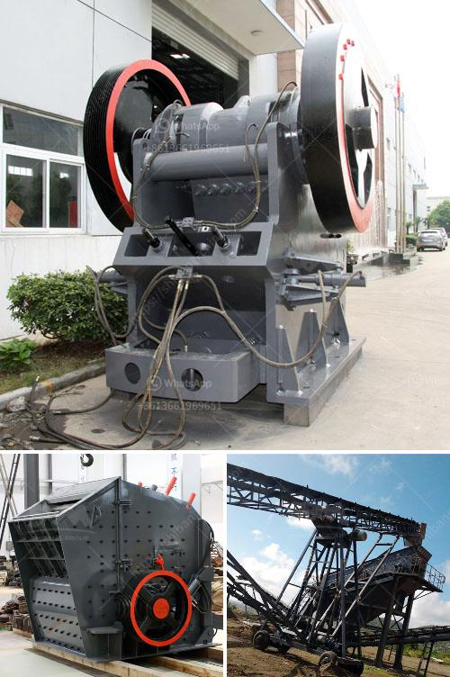

<h3>how vibrating screen works ?</h3>
The vibrating screen is commonly used to help grind materials as well as crush them before they are segregated and identified into raw products. When it comes to machinery, the vibrating screen transforms materials into manageable sizes. It does so by oscillating in a unique way using different angles and tendencies.

The screen is fitted with a series of screens attached to a motor for vibrating. The materials divided by these screens are then separated and identified into various grades depending on their size. This process guarantees that only the correct sized materials are used in production. Any oversized materials are sent back to the start of the process for further crushing and re-screening.

So, how exactly does a vibrating screen work? It starts by feeding the raw materials into the screen— desirable-sized materials pass through while oversize materials get discharged. There is, however, one crucial component that determines the entire process—the vibrating mechanism. It’s what gives the vibrating screen its ability to separate materials efficiently and precisely.

Vibrating screens rely on the eccentric motion of the screen box to separate materials. Typically, the screen utilizes double-bearing eccentric shafts mounted on the top and bottom of the machine, along with horizontally arranged springs that store and release kinetic energy to promote the throwing motion of the materials. This mechanism ensures that the material is evenly distributed over the entire screening surface.

As the screen box oscillates, it also produces different types of movement. The two most crucial types of movement are linear and elliptical. Linear motion refers to the forward and backward swinging motion of the screen box. This type of movement is typically used when different sizes or free-flowing bulk materials are being processed, as it helps generate greater screening efficiency and capacity.

On the other hand, elliptical motion occurs when the screen box moves along a circular or elliptical path. This type of motion is used when screening sticky or relatively difficult-to-screen materials. It prevents material build-up on the screen surface and ensures efficient screening.

The vibrating mechanism in the screen box is powered by an electric motor. The motor's rotational movement is converted into the oscillating motion of the screen box through a set of gears and belts. This ensures that the screen can operate smoothly and efficiently.

To optimize the screening process, vibrating screens are equipped with different types of screen media, such as woven wire cloth, screen panels, and perforated plates. Each type of media has unique characteristics, such as opening size, shape, and material composition, which affects the screening performance.

In conclusion, vibrating screens are vital pieces of equipment in the mining and mineral processing industries. Their function is to separate materials based on specific sizes using oscillating motion. By utilizing different types of motion and screen media, vibrating screens efficiently classify and segregate raw materials, ensuring that only appropriate sizes are used in the production process. Whether it is for grading, separating, or scalping, the versatility and efficiency of vibrating screens make them essential machinery in various industrial sectors.
<h3>Contact us</h3><ul><li><strong>Whatsapp:&nbsp;<a href="https://wa.me/8613661969651">+8613661969651</a></strong></li><li><a href="https://swt.shibang-china.com/?git&amp;zhl&amp;how vibrating screen works "><strong>Online Service(chat now)</strong></a></li></ul><h3>Related</h3><ul><li><a href='How does a stone crusher work？.md'>How does a stone crusher work？</a></li><li><a href='How much is the quarry machinery .md'>How much is the quarry machinery ?</a></li><li><a href='How to do the maintenance of crushing screening plant.md'>How to do the maintenance of crushing screening plant?</a></li><li><a href='How to choose manganese ore crushing machinery.md'>How to choose manganese ore crushing machinery?</a></li><li><a href='How to work a roller grinding mill.md'>How to work a roller grinding mill?</a></li></ul>